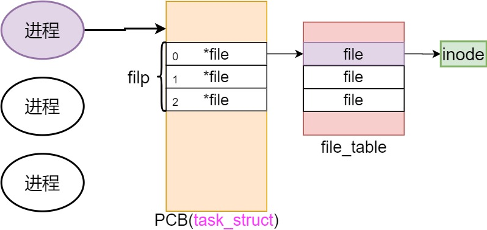
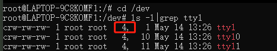

从一行代码开始：

```java
    printf("Name: %s",parm)
```

先根据参数格式化文本，接着将文本打印到屏幕。找到linux中printf函数的实现：

```java
int printf(const char*fmt,...){
    va_list args;
    int i;
    va_start(args,fmt);
    write(1,printbuf,i=vsprintf(printbuf,fmt,args));
    va_end(args);
    return i;
}
```
最终会使用write()这一系统调用，本文会围绕着write的底层实现与设计思想来展开。

---

- 打印到屏幕如何实现？

下面是cpu、内存、外设组成的图像：

```markdown
                +-------+    +--------+
                |  CPU  |    | Memory |
                +---+---+    +---+----+
                    |            |
CPU-Memory Bus  +---+------+-----+----+
                           |
                  +--------+-------+
                  | Bus Controller |
                  +--------+-------+
                           |
       PCI Bus  +----------+---------------------------------------+---------------+
                                                                   |
                                                            +------+-------+
                                                            | Video memory |
                                                            +--------------+
```

流程：CPU发出写命令``->``CPU睡眠 ``->`` 写外设对应的寄存器 ``->`` 外设完事后向CPU发中断信号``->``CPU执行对应的中断处理程序。

    对于我们来说，最为核心的还是第一步。考虑的点非常多：

        是否统一编址，mov还是out？
        写哪个寄存器？
        先写高位还是先写低位？
        不同外设的标准还不一样。


为了解决这一问题，需要一个统一的接口，所以就有了『文件视图』：

    1.任何外设的操作都是open、read、write、close这几个系统调用
    2.不同的设备对应不同的设备文件（/dev/xxx）

那么操作IO都从IO接口开始，在系统调用层产生不同的分支，在设备驱动层操作硬件：
```
         +------+   +------+  +-------+   +-------+
Sys_call | open |   | read |  | write |   | close |
         +--+---+   +---+--+  +---+---+   +---+---+
            |           |         |           |
            +-----------+---------+-----------+
                           解释
                            |
         +------------------v---------------------+
  Driver |    command           interrupt handler |
         +-------+-----------------------^--------+
                 |                       ^
                 |                       |
         +-------v-----------------------+--------+
         |      Device controller(ex:disk)        |
Hardware +----------------------------------------+
         |                 Device                 |
         +----------------------------------------+
```
那么``write(1,printbuf,i=vsprintf(printbuf,fmt,args));``是怎么将文本打印到屏幕上的呢？

直接看sys_write的关键逻辑：

```cgo
    int sys_write(unsigned int fd, char * buf, int count){
        struct file * file;
        struct m_inode * inode;
        //current为当前进程，fd是是filp的下标（file的索引）
        if (fd >= NR_OPEN || count < 0 || !(file = current->filp[fd])) {
            return -EINVAL;
        }
        if (!count) {
            return 0;
        }
        //根据文件类型执行相应的写操作
        inode = file->f_inode;
        if (inode->i_pipe) { //管道
            //file->f_mode & 2 即是否有写的权限
            return (file->f_mode & 2) ? write_pipe(inode, buf, count) : -EIO;
        }
        if (S_ISCHR(inode->i_mode)) {//字符设备
            return rw_char(WRITE, inode->i_zone[0], buf, count, &file->f_pos);
        }
        if (S_ISBLK(inode->i_mode)) {//块设备
            return block_write(inode->i_zone[0], &file->f_pos, buf, count);
        }
        if (S_ISREG(inode->i_mode)) {//文件
            return file_write(inode, file, buf, count);
        }
        ...
        return -EINVAL;
    }
```
从代码中可以看出来，sys_write会先从当前进程的filp数组中找到具体的file，然后根据文件类型执行相应的写操作。以上代码会有一些点值得注意：
    
    filp是啥？
    f_inode是啥？
    f_mode是啥？

既然filp是从当前进程中获取的，那一定是从fork系统调用的『copy_process』中来的：

```cgo
    struct task_struct {
        ...                             
        int tty;                        //进程使用tty终端的子设备号。-1表示没有使用	
        unsigned short umask;           //文件创建属性屏蔽位 
        struct m_inode * pwd;           //当前工作目录i节点结构指针 
        struct m_inode * root;          //根目录i节点结构指针 
        struct m_inode * executable;	//执行文件i节点结构指针 
        struct m_inode * library;       //被加载库文件i节点结构指针 
        unsigned long close_on_exec;    //执行时关闭文件句柄位图标志 
        struct file * filp[NR_OPEN];    //文件结构指针表，最多32项。表项号即是文件描述符的值 
        struct desc_struct ldt[3];      //局部描述符表(段表), 0-空，1-代码段cs，2-数据和堆栈段ds&ss 
        struct tss_struct tss;          //进程的任务状态段信息结构 
    };
    
    int copy_process(int nr, /*省略一堆寄存器*/){
        ...
        //申请空闲的物理页
        p = (struct task_struct *) get_free_page();
        ...
        //复制父进程的内存页表，没有分配物理内存，共享父进程内存（虚拟内存部分看本人的其他文章）
        if (copy_mem(nr,p)) {
            task[nr] = NULL;
            free_page((long) p);
            return -EAGAIN;
        }
        //修改打开的文件，当前工作目录，根目录，执行文件，被加载库文件的使用数
        for (i = 0; i < NR_OPEN; i++) {
            if ((f = p->filp[i])) {
                f->f_count ++;//引用计数
            }
        }
        ...
    }
```
从代码中可以看出来filp是『进程描述符』的一个字段，而且是从父进程中拷贝过来的。我们知道进程是从init进程开始一层层fork出来的，
所以需要看linux初始化的逻辑。

`在linux中，task_struct就是所谓的PCB，被称为『进程描述符』，也叫『进程控制块』`

```cgo
    void init(void){
        int pid, i;
        setup((void *) &drive_info);
        //tty是终端设备，open会返回fd
        (void) open("/dev/tty1", O_RDWR, 0);	//stdin
        (void) dup(0);                          //stdout
        (void) dup(0);                          //stderr
        ...
        //fork出任务2
        if (!(pid = fork())) {
            ...
            execve("/bin/sh", argv_rc, envp_rc);
            ...
        }
        ...
    }
```
init中打开了``/dev/tty1``字符设备文件(终端)，并使用``dup``系统调用复制两次，返回0、1、2三个fd分别作为标准输入、标准输出、标准错误。
后续使用fd进行write就能写到对应的设备，可以得出``open``系统调用里一定有fd与设备的映射关系！

看``sys_open``的逻辑：
```cgo
    int sys_open(const char * filename, int flag, int mode){
        struct m_inode * inode;
        struct file * f;
        int i, fd;
        mode &= 0777 & ~current->umask;
        //查filp(文件描述符表)
        for(fd = 0; fd < NR_OPEN; fd ++) {
            if (!current->filp[fd]) {
                break;
            }
        }
        if (fd >= NR_OPEN) {
            return -EINVAL;
        }
        current->close_on_exec &= ~(1<<fd);
        //在文件表中找到空闲的文件结构项
        f = 0 + file_table;
        for (i = 0; i < NR_FILE; i++, f++) {
            if (!f->f_count) {
                break;
            }
        }
        if (i >= NR_FILE) {
            return -EINVAL;
        }
        (current->filp[fd] = f)->f_count++;
        //在内存的索引节点表中找到文件对应的i节点
        if ((i = open_namei(filename, flag, mode, &inode)) < 0) {
            current->filp[fd] = NULL;
            f->f_count = 0;
            return i;
        }
        //ttys are somewhat special (ttyxx major==4, tty major==5)
        if (S_ISCHR(inode->i_mode)) {
            if (check_char_dev(inode, inode->i_zone[0], flag)) {
                iput(inode);
                current->filp[fd] = NULL;
                f->f_count = 0;
                return -EAGAIN;
            }
        }
        //Likewise with block-devices: check for floppy_change
        if (S_ISBLK(inode->i_mode)) {
            check_disk_change(inode->i_zone[0]);
        }
        f->f_mode = inode->i_mode;
        f->f_flags = flag;
        f->f_count = 1;
        f->f_inode = inode;
        f->f_pos = 0;
        return (fd);
    }
```
``open_namei是文件系统相关代码，后面再讲``

上述sys_open流程如下：

    1.查文件描述符表(filp)，找到最小且空闲的文件描述符(fd)

    2.查文件表(file_table)，找到最小且空闲的文件项(file)

    3.建立文件描述符(fd)与文件项目(file)的映射

    4.使用open_namei查询目录，找到文件名(filename)对应的inode(inode很重要，后面会讲)

    5.给文件项(file)填充数据(imode、inode等)

总之，形成了这么一个图像：




ok，现在知道了能通过``fd``能找到``inode``，那么可以继续讲``sys_write``了：

```cgo
    int sys_write(unsigned int fd, char * buf, int count){
        struct file * file;
        struct m_inode * inode;
        //current为当前进程，fd是是filp的下标（file的索引）
        if (fd >= NR_OPEN || count < 0 || !(file = current->filp[fd])) {
            return -EINVAL;
        }
        if (!count) {
            return 0;
        }
        //根据文件类型执行相应的写操作
        inode = file->f_inode;
        if (inode->i_pipe) { //管道
            //file->f_mode & 2 即是否有写的权限
            return (file->f_mode & 2) ? write_pipe(inode, buf, count) : -EIO;
        }
        if (S_ISCHR(inode->i_mode)) {//字符设备
            return rw_char(WRITE, inode->i_zone[0], buf, count, &file->f_pos);
        }
        if (S_ISBLK(inode->i_mode)) {//块设备
            return block_write(inode->i_zone[0], &file->f_pos, buf, count);
        }
        if (S_ISREG(inode->i_mode)) {//文件
            return file_write(inode, file, buf, count);
        }
        ...
        return -EINVAL;
    }
```
由于传入的``fd``就是1，那么对应的文件就是``init``中``open``的``/dev/tty1``，而``/dev/tty1``的``inode``信息中体现出他是一个字符设备，所以走到``rw_char``的逻辑：

``inode具体有什么意义，后面会讲``

```cgo
    //dev为 inode->i_zone[0]，这是设备号
    int rw_char(int rw, int dev, char * buf, int count, off_t * pos){
        crw_ptr call_addr;
        if (MAJOR(dev) >= NRDEVS) {
            return -ENODEV;
        }
        //MAJOR取主设备号
        if (!(call_addr = crw_table[MAJOR(dev)])) {
            return -ENODEV;
        }
        //MINOR取次设备号
        return call_addr(rw, MINOR(dev), buf, count, pos);
    }
    //字符设备读写函数指针表
    static crw_ptr crw_table[]={
        NULL,rw_memory,NULL,NULL,rw_ttyx,rw_tty,NULL,NULL
        };	
```



从inode中拿到设备号，再根据``主设备号``调用真正的``call_addr``，这里可以很明显看出来是``rw_ttyx``：

``经过一顿折腾，终于可以写屏幕了!``

```cgo  
    //用来找到真正要执行的wite
    #define TTY_TABLE(nr) \
    (tty_table + ((nr) ? (((nr) < 64)?(nr)-1:(nr)) : fg_console))

    static int rw_ttyx(int rw, unsigned minor, char * buf, int count, off_t * pos){
        return ((rw == READ) ? tty_read(minor, buf, count) 
            : tty_write(minor, buf, count));
    }
    //minor为次设备号
    int tty_write(unsigned channel, char * buf, int nr){
        struct tty_struct * tty;
        char c, *b = buf;
        ...
        tty = TTY_TABLE(channel);
        ...
        while (nr>0) {
            //如果tty设备的write_q（写缓冲区）满了，就睡眠
            sleep_if_full(tty->write_q);
            if (current->signal & ~current->blocked)
                break;
            while (nr>0 && !FULL(tty->write_q)) {
                //从用户空间读取buf数据
                c=get_fs_byte(b);
                ...
                //省略了一些对/r/n的处理
                b++; nr--;
                cr_flag = 0;
                //放到写队列里
                PUTCH(c,tty->write_q);
            }
            //写到write_q后直接执行tty的write（这是一个面向对象的写法）
            tty->write(tty);
            if (nr>0)
                //如果write_q写满以后，发现还有剩余数据，就主动发起调度，等待下次执行
                schedule();
        }
        return (b-buf);
    }
```
首先通过``次版本号``从``TTY_TABLE``中找到具体的write函数，``TTY_TABLE``宏函数中的``tty_table``由``tty_init``初始化：
```cgo
    #define con_table tty_table
    #define rs_table (64+tty_table)
    #define mpty_table (128+tty_table)
    #define spty_table (192+tty_table)
    //tty数据结构
    struct tty_struct {
        struct termios termios;//终端io属性和控制字符数据结构
        int pgrp;//所属进程组
        int session;//会话号
        int stopped;//停止标志
        void (*write)(struct tty_struct * tty);//tty写函数指针
        struct tty_queue *read_q;//tty读队列
        struct tty_queue *write_q;//tty写队列
        struct tty_queue *secondary;//tty辅助队列(存放规范模式字符序列)
    };
    
    void tty_init(void){
        ...
        for (i = 0; i < NR_CONSOLES; i++) {
            con_table[i] = (struct tty_struct) {
                {ICRNL,OPOST|ONLCR,0,IXON | ISIG | ICANON | ECHO | ECHOCTL | ECHOKE,0,INIT_C_CC},
                0,0,0,
                con_write,
                con_queues+0+i*3,con_queues+1+i*3,con_queues+2+i*3
            };
        }
        for (i = 0; i < NR_SERIALS; i++) {
            rs_table[i] = (struct tty_struct) {
                {0,0,B2400 | CS8,0,0,INIT_C_CC},
                0,0,0,
                rs_write,
                rs_queues+0+i*3,rs_queues+1+i*3,rs_queues+2+i*3
            };
        }
        ...
    }
```
OK，从上面的图可以知道`/dev/tty1`的`次版本号`为`1`，那么结合``tty_init``和``TTY_TABLE``，可以算出最终要执行的``write``函数是『**con_write**』：

**这次是真的要输出到屏幕了！**
```cgo
   #define pos		(vc_cons[currcons].vc_pos)
   void con_write(struct tty_struct * tty){
        int nr;
        char c;
        int currcons;
        currcons = tty - tty_table;
        ...
        nr = CHARS(tty->write_q);
        while (nr--) {
            if (tty->stopped)
                break;
            //从write_q中获取字符
            GETCH(tty->write_q,c);
            if (c == 24 || c == 26)
                state = ESnormal;
            switch(state){
                case ESnormal:
                    if (c>31 && c<127) {
                        if (x>=video_num_columns) {
                            x -= video_num_columns;
                            pos -= video_size_row;
                            lf(currcons);
                        }
                        //输出到屏幕
                        __asm__("movb %2,%%ah\n\t"
                            "movw %%ax,%1\n\t"
                            ::"a" (translate[c-32]),
                            "m" (*(short *)pos),
                            "m" (attr)
                            );
                        pos += 2;
                        x++;
                    }
                    ...//省略几百行的各种字符判断
            }
        }
        blankcount = blankinterval;
        if (currcons != fg_console)
          return;
        //重新设置光标
        set_cursor(currcons);
   }
```
首先从write_q中获取字符，再将字符输出到屏幕，这里的核心是那一段``_asm_``：
```cgo
            __asm__("movb %2,%%ah\n\t"
                    "movw %%ax,%1\n\t"
                    ::"a" (translate[c-32]),
                    "m" (*(short *)pos),
                    "m" (attr)
            );
```
`"a" (translate[c-32])`把字符写到`ax`寄存器,`%2`操作数对应`attr`，`%1`对应`pos`。所以`movb %2,%%ah`把字符的属性`attr`赋给`ax`寄存器的高8位，紧接着
`movw %%ax,%1`把`ax`赋给`pos`。总之，就是为了把`字符`和`属性`赋给`pos`。

显存部分待续......


