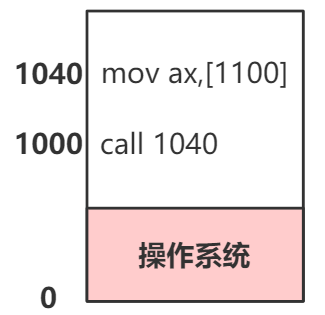
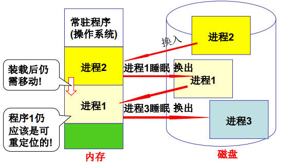
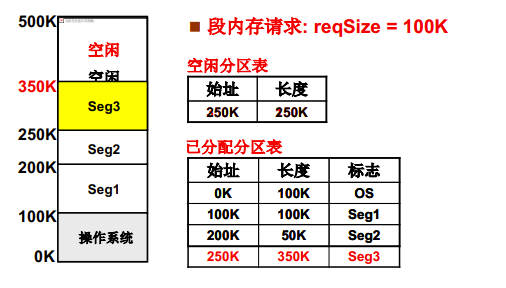
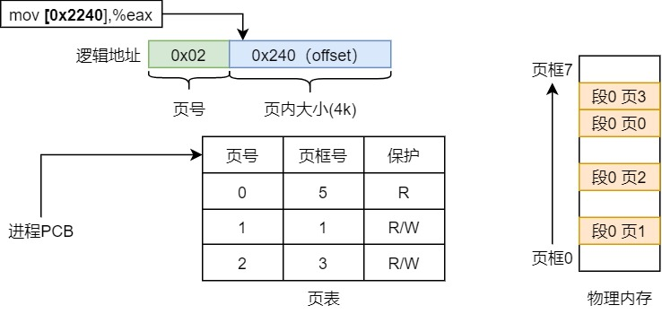
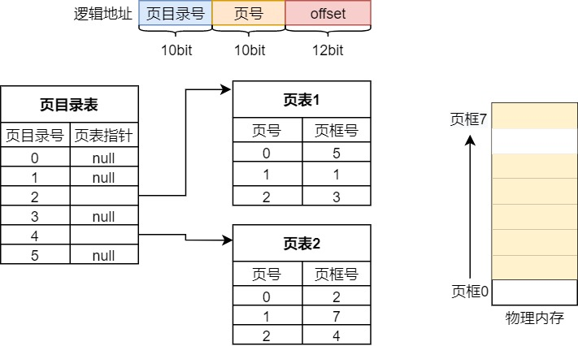
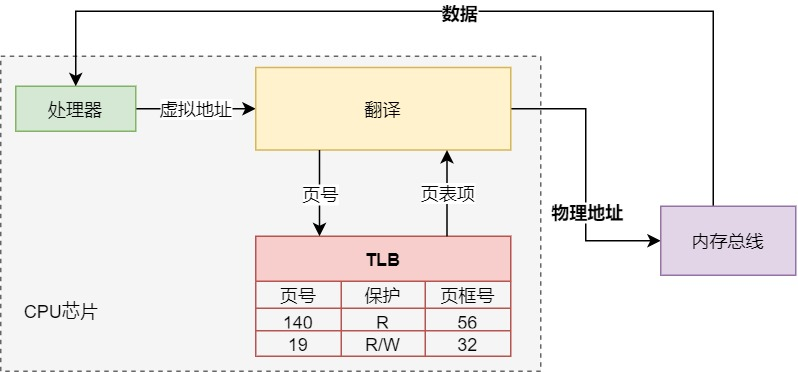
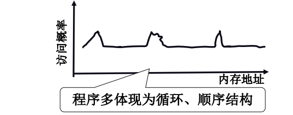
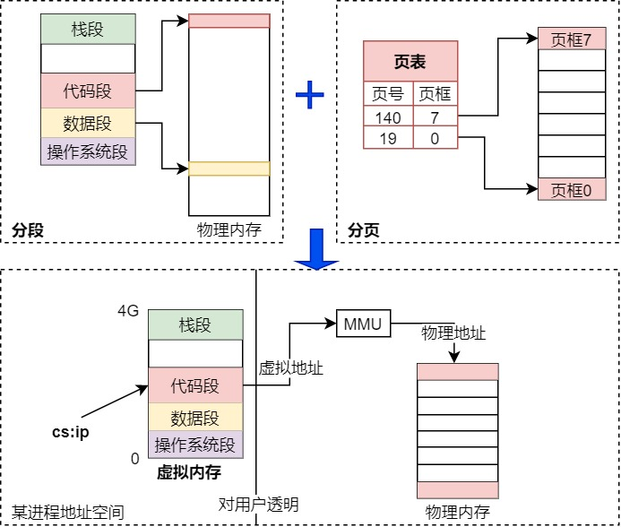
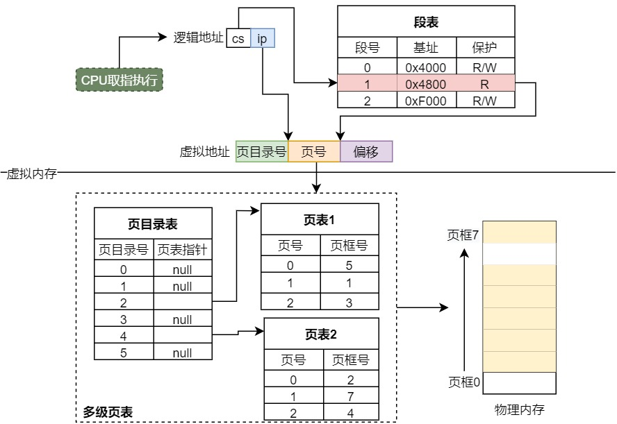
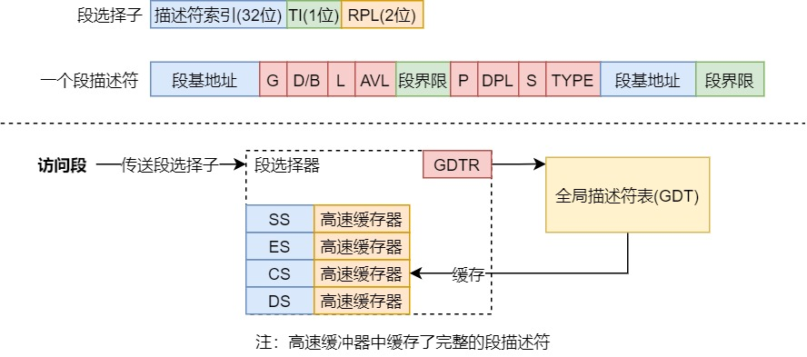

### 如何使用物理内存?

有且仅有这一种办法：将一个程序加载到内存，PC指向程序首地址， 在CPU取指执行的过程中，内存已经被使用了。 程序是存储在磁盘上的（先忽略加载的过程）， 那么程序该加载到内存的哪个位置呢？

```nasm
(40) _main: mov ax,[100]
             ...
(0)         call 40
```

如果40和0都是真实的物理地址，为了让『call 40』好使，main必须放到物理内存中40位置，局限性相当大，要是其他程序也想放到40位置呢，那么先得需要找到空闲内存。

如果恰好1000位置空闲，那么把程序加载到1000位置，并1000赋给IP，CPU开始取值执行， 『call 40』又跳到了物理内存40位置，还是不好使。 仅仅修改PC初始地址是不够的， 还需要另外一个概念：重定位（修改程序中的地址）



### linux何时重定位?

**编译连接时/加载时？**

    编译时：编译期就得确认内存的位置，对于一些特殊的嵌入式软件，可能是合理的。

    加载时：一旦载入内存就不能动了，必须常驻内存！

**swap**

    高级操作系统都应有swap的概念，在物理内存不够时，将一部分睡眠状态的进程换出
    到磁盘，等到该进程重新换入到内存时，其实又需要重定位！因为这个时候物理内存的
    布局很有可能发生了变化，这就引出了一个概念：运行时重定位。



**运行时重定位**

    每执行一条指令前都需要地址翻译：从逻辑地址算出物理地址。那么采用基地址(base)+偏移量(offset)去定义逻辑地址，
    base就放到PCB中好了，基地址的话x86有对应的基地址寄存器（EB），地址翻译则有相应的硬件MMU，那么每个进程都可
    以拥有自己的内存了。

---

那么整理一下思路，程序载入是整个一起载入内存的吗？

### 分段

    不，我们希望有多个分段：代码/变量/函数库/动态数组/栈，这样可以独立考虑每个段，不会
    写变量的时候不小心把代码给改了，而且每个段扩容也变得很方便。


    如何管理不同段的段号/基地址/权限呢？那么就有了LDT表，放到每个进程的PCB中，对应的寄存器为LDTR。

| 段号 | 基址 | 长度 | 保护 |
| :---:| :----: | :----: | :----: |
| 0 | 180k | 150k | R
| 1 | 360k | 60k | R/W

    比如一条指令：jmp 40，那么当前的CS寄存器为40，假如当前代码段的段号为0，
    那么查询段表找到基址加上偏移40，那么就找到了程序跳转的物理地址。



    仅仅分段还是会有问题。如果现在有多个段需要分配物理内存，那么物理内存该怎么分呢？
    很容易就能想到需要『空闲段表』和『已分配段表』去维护物理内存。如果发起分配请求
    req=100k，发现总空闲内存>100k，但是没有连续的空闲内存>100k，如何分配？这个问题
    就是内存碎片，解决这个问题可以将空闲内存合并（内存缩紧），内存缩紧需要进行段的复制，
    耗费大量的时间！

### 分页

- **从连续到离散**


    那么可以把物理内存分为多个页，分配内存时直接分配任意几个空闲页框，然后使用页表来维护
    内存，页表可以有页号/页框号/特权级。比如现在需要分配n个大小的内存（k个连续的页面），
    并映射到具体的物理内存页框。由于页表的工作方式，现在也不需要那么大的连续内存了！页框
    可以随机分配到物理内存。
    
    例如『mov [0x2240],%eax』
    当前每页大小为4k，算页号需要右移12位，得到页号为0x2偏移为0x240，很快就能找到所在
    物理内存的位置。上述计算过程，为专门的硬件（MMU）完成的。进程切换CR3寄存器跟着切换，
    页表就产生了，MMU基于页表来进行计算。那么页查找的全过程就完成了。



- **多级页表和TLB寄存器**

页表该如何设计？

    1.所有的页都有页表：
  
      假如当前是32位系统，可以有4G的寻址空间，页面大小通常为4k，32位地址会有2^20个页面，
    如果那么多个页表项都放在内存中，需要4M内存，如果系统并发10个进程那么就需要40M内存，
    实际上大多数的逻辑地址根本不会用到。//根据程序的『局部性』。

    2.用到的页才有页表项：

      但是这样页号不连续，需要用二分查找，时间复杂度O(log2n)。

既要连续又要降低空间复杂度，那么就有了多级页表。

    那么就抽出一个页目录表作为页表的索引，一来页目录表保存了所有的页目录，可以连续；
    二来被使用到的页目录才会有对应的页表，降低了空间占用。



多级页表引入了新的问题

    每次寻址都需要查询多级页表，增加了访存次数，哪怕碰巧页表项在l1缓存中，性能会下降一到两个
    周期。最差的情况下，每次都会去内存中多取一次数据，性能会下降几十到几百个周期。

    为了降低这一开销，那么就有了TLB。TLB是一组相联快递存储，是一个寄存器，也被称作快表。
    TLB存储了最近使用的页号与其对应页框号，处理流程如下：

      1.CPU产生一个虚拟地址
      
      2.MMU查询TLB，取出对应的页表项（命中）
        
      3.MMU将这个虚拟地址翻译成物理地址，传给内存总线
      
      4.内存总线将物理地址对应的的数据返回给对应的处理器
  
    如果不命中，MMU将会查询高速缓存/内存中的页表，并将新取出的页表项放到TLB中，下图为TLB命中的情况:



```cgo
有了TLB后效率呢？基于上述流程可以算一个数学期望：
  有效访问时间 = HitR*(TLB+MA)+(1-HitR)*(TLB+2MA)，其中HitR为TLB命中率，
TLB和MA分别为访问耗时。 
    
按命中率98%计算，有效访问时间=98%*(20ns+100ns)+2%*(20ns+200ns)=122ns，近乎访存一次的开销，
上述结果非常依赖TLB的命中率，该命中率得益于『程序』的『局部性』。截取CS:APP书上的一段话：

  ｜尽管在整个运行过程中程序引用的不同页面的总数可能会超过物理内存的总大小，但是『局部性』保证了在
任意时刻，程序将趋于在一个较小的active page集合上工作。在初始开销，也就是将工作集页面调度到内存
中以后，接下来对这个active page的引用将会命中，而不会产生额外的磁盘流量。｜

由此可以得出TLB的命中率非常高。
```



---

### 段页结合 => 虚拟内存

    结合分段和分页，总结出：

      1.应用程序希望能分段(独立考虑每个段)；
      2.物理内存希望能分页(提高分配效率)。

    那么能不能来个东西把他们都组合起来，那么就有了『虚拟内存』，对于用户来虚拟内存是透明，而用户
    程序可以以段的方式去访问虚拟内存。



    那么访问内存的方式就变成了『段号+偏移』，用CPU取指执行这一访存动作举例：

        这里逻辑地址为cs:ip，先查段表，找到cs段对应段号的基址，再加上ip组合成虚拟地址，推给MMU，
    MMU根据逻辑地址查询页表，拿到物理地址交给内存总线，获取到对应的指令数据。如下图：



- **『为什么要有虚拟内存』理论部分就结束了，后面是linux上虚拟内存的源码分析（部分）和虚拟内存的一些拓展应用**

---

### linux内存管理源码分析(linux 0.12)

如何使用内存，前面提到过：先把程序『放入内存』，在CPU取指执行的过程中就开始『使用内存』了。
那么linux何时开始进行内存管理呢？ 很容易想到从fork系统调用的内存分配阶段开始：分配段、建段表；
分配页、建页表。

```java
  从sys_fork开始
   
  流程: sys_fork -> copy_process ,所以直接看copy_process的实现
  
  int copy_process(... ){
        //申请一页空闲物理页面，下面会讲
        struct task_struct *p = get_free_page();
        //给task_struct放一些数据
        ...
            //重点看
        copy_mem();
  }
    
  //nr为进程序号
  int copy_mem(int nr, struct task_struct * p){
        unsigned long old_data_base, new_data_base, data_limit;
        unsigned long old_code_base, new_code_base, code_limit;
    
        code_limit = get_limit(0x0f);
        data_limit = get_limit(0x17);
        old_code_base = get_base(current->ldt[1]);
        old_data_base = get_base(current->ldt[2]);
        if (old_data_base != old_code_base) {
            panic("We don't support separate I&D");
        }
        if (data_limit < code_limit) {
            panic("Bad data_limit");
        }
        //TASK_SIZE是linux上每个进程的大小（64M），这里直接在虚拟内存上隔离了不同进程的段
        //linux0.12只能映射4G的线性地址，每个进程大小只给64M，最多64个进程。
        //所以不同进程的虚拟地址完全不重叠，所以进程切换连页目录表都不需要切（全局共享一个页目录表）！
        //注意现代linux每个进程都可以独立映射4G的线性地址（32位），而且虚拟地址都是会重叠的，每个进程都有独立的页目录表！
        new_data_base = new_code_base = nr * TASK_SIZE;
        p->start_code = new_code_base;
        //linux 0.12实现比较简单，代码段和数据段用同一个基址
        //建段表
        set_base(p->ldt[1], new_code_base); //代码段
        set_base(p->ldt[2], new_data_base); //数据段
            
            
        //页表相关,重点看这个
        if (copy_page_tables(old_data_base, new_data_base, data_limit)) {
            free_page_tables(new_data_base, data_limit);
            return -ENOMEM;
        }
        return 0;
  }

  //复制页表，进程的COW机制
  int copy_page_tables(unsigned long from, unsigned long to, long size){
        ...
        //这里为啥右移20位很重要，由于是32位虚拟地址：[10位页目录号][10位页号][12位偏移]
        //所以需要右移动22位得到页目录号，每个页目录项4个字节，为得到具体的页目录项指针需要(from >> 22)*4=(from >> 20)
        from_dir = (unsigned long *) ((from >> 20) & 0xffc); //源地址页目录项指针
        to_dir = (unsigned long *) ((to >> 20) & 0xffc);     //目标地址页目录项指针
        size = ((unsigned) (size + 0x3fffff)) >> 22;
        
        //开始复制页目录项
        for(; size-->0; from_dir++, to_dir++){
            from_page_table=(0xfffff000&*from_dir);
            //新的进程有独立的页表，所以申请一页空闲物理页面，下面会讲
            to_page_table=get_free_page();
            //复制当前页表的nr个页表项
            for (; nr-- > 0; from_page_table++, to_page_table++) {
                    this_page = *from_page_table;
                    if (!this_page) {
                        continue;
                    }
                    //该页面在交换设备中，申请一页新的内存，然后将交换设备中的数据读取到该页面中
                    if (!(1 & this_page)) {
                        if (!(new_page = get_free_page())) {
                             return -1;
                        }
                        read_swap_page(this_page >> 1, (char *)new_page);
                        *to_page_table = this_page;
                        *from_page_table = new_page | (PAGE_DIRTY | 7);
                             continue;
                    }
                    this_page &= ~2; // 让页表项对应的内存页面只读
                    *to_page_table = this_page;
                    //物理页面的地址在1MB以上，需要在mem_map[]中增加对应页面的引用次数
                    if (this_page > LOW_MEM) {
                        *from_page_table = this_page; //令源页表项也只读
                        this_page -= LOW_MEM;
                        this_page >>= 12;
                        //增加对应页面的引用次数
                        mem_map[this_page]++;
                    }
            }
        }
  }
  
  //申请一页空闲物理页面
  unsigned long get_free_page(void){
        register unsigned long __res;
        //在内存映射字节位图中从尾到头地查找值为0的字节项，然后把对应物理内存页面清零
        repeat:
            __asm__("std ; repne ; scasb\n\t"
                "jne 1f\n\t"
                "movb $1,1(%%edi)\n\t"
                "sall $12,%%ecx\n\t"
                "addl %2,%%ecx\n\t"
                "movl %%ecx,%%edx\n\t"
                "movl $1024,%%ecx\n\t"
                "leal 4092(%%edx),%%edi\n\t"
                "rep ; stosl\n\t"
                "movl %%edx,%%eax\n"
                "1:"
                :"=a" (__res)
                :"0" (0), "i" (LOW_MEM), "c" (PAGING_PAGES),
                "D" (mem_map + PAGING_PAGES - 1)
            );
        if (__res >= HIGH_MEMORY) {	// 页面地址大于实际内存容量，重新寻找
            goto repeat;
        }
        if (!__res && swap_out()) {	// 没有得到空闲页面则执行交换处理,并重新查找
            goto repeat;
        }
            return __res;
  }

```

总结：

    fork系统调用会去申请物理页，用来映射task_struct和页表（每个进程私有），接着复制页表项，并将『源/新』两个进程的所有页表项标记为只读，
    并将两个进程的每个区域结构都标记为私有的写时复制，最终，fork系统调用返回，产生的新进程的地址空间看上去就和源进程一模一样了。

    当这两个进程的任意一个发生『写操作』时，那么这个写操作就会触发一个『故障』，那么内核中的『故障处理程序』就会在物理内存中创建所写页面的新副本，
    更新页表指向这个新的副本，接着恢复对应虚拟页面的写权限。ok，『故障处理程序』可以返回了，那么将ip指回刚刚的『写操作』，CPU重新执行重新写
    的时候就可以在新的物理页上操作了!

    这就是所谓进程的copy-on-write机制，

---

- **换入/换出**
  
    
    如果是32位操作系统，每个进程拥有独立的4g地址空间，而物理内存大小也就4g，能做到这点也正是前面提过的swap机制。
    
    案例：CPU提供一个逻辑地址（段号加偏移），MMU查询页表时发现没有对应的物理内存页框，那么MMU就会产生一个『缺页中断』，
    缺页中断处理程序将会将磁盘上对应的页文件换入。一部分逻辑由硬件（MMU）完成，所以换入部分的源码分析只需要看缺页中断
    处理程序。

|  中断号   | 名称 | 说明 |
|  ----  | ----  | ---- |
| 12  | Segment not Present | 描述符指定的短不存在 |
| 14  | Page fault | 页不在内存 |

```cgo
    //中断处理程序初始化
    void trap_init(void){
        set_trap_gate(14, &page_fault); //保存14号中断与其处理程序
    }
    #define set_trap_gate(n, addr) \
        _set_gate(&idt[n], 15, 0, addr); 
        
    //直接来看缺页中断处理程序（mm/page.s）
    page_fault:
    xchgl 	%eax, (%esp)    // 取出错码到eax
    pushl 	%ecx
    pushl 	%edx
    push 	%ds
    push 	%es
    push 	%fs
    
    
    movl 	$0x10, %edx     // x86的保护模式下，访问内存需要基于段选择器（如CS、DS、ES、SS）
                            // 而各段选择器与基址的对应关系存在GDT表中（GDT表的首地址位于GDTR寄存器）,对应前面的段表
                            // 而段表中的段表项在x86里叫段选择子，组成结构：[描述符索引][TI][请求特权级]，其中TI为描述符表指示器（0：要查GDT，1：要查LDT）
                            // x86部分可以看看下面的图
                            // 这里将0x10传给edx是为了切换为内核的段基址，毕竟中断处理程序是要在内核态执行的嘛
    mov 	%dx, %ds        // 置为内核栈对应的数据段选择子（为了后续查询段描述符）
    mov 	%dx, %es        // 同上
    mov 	%dx, %fs        // 同上，这几行代码不清楚可以看看下面的图
    
    
    movl 	%cr2, %edx      // 取引起页面异常的虚拟地址，cr2则是故障虚拟地址寄存器，还有cr0,cr1,cr2,cr3,cr8
    pushl	%edx           	// 将该线性地址和出错码压入栈中，作为将调用函数的参数
    pushl 	%eax
    testl 	$1, %eax        // 测试页存在标志P(位0)，如果不是缺页引起的异常则跳转
    jne 	1f
    call 	do_no_page      // 调用缺页中断处理函数(mm/memory.c)
    jmp 	2f
1:	call 	do_wp_page      // 调用写保护处理函数(mm/memory.c)
2:	addl 	$8, %esp        // 丢弃压入栈的两个参数，弹出栈中寄存器并退出中断
    pop 	%fs
    pop 	%es
    pop 	%ds
    popl 	%edx
    popl 	%ecx
    popl	%eax
    iret
```



    补充图的注释
---

经过一顿折腾，终于可以看『换入』是咋实现的了！

```java
    //do_no_page

```

- **虚拟内存的一些拓展应用**