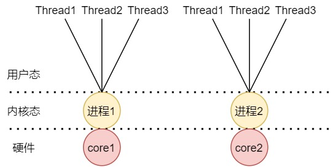
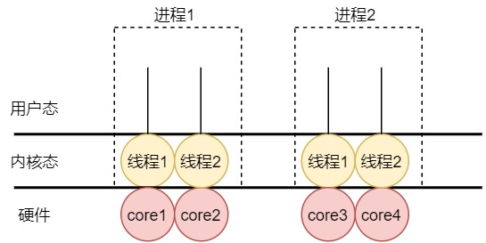
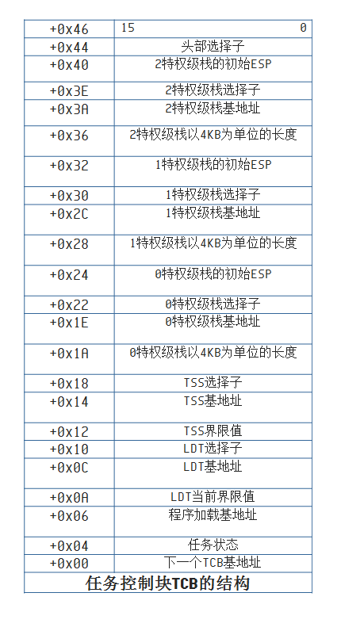
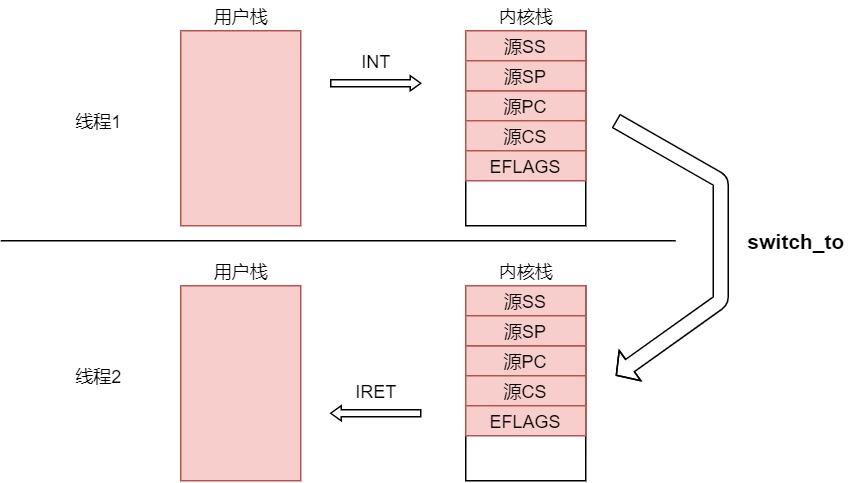

[这篇文章](为什么要有虚拟内存.md)提到了多进程的几个点：

    1.地址空间隔离

    2.指令执行序列隔离

多进程上下文切换需要：

    1.保存现场
    
    2.切换指令执行序列

    2.切换PCB、切换映射表(数据、资源)，重新加载并缓存页表。

仅仅为了提高并发能力而使用多进程，会带来额外的开销，而且地址空间隔离，使内存共享变得麻烦。能不能只切换『指令执行序列』，资源不动？
那么就有了线程。

- ###用户级线程



```
一个进程可以有多个用户级线程，对应多个用户栈，可以通过切换PC来切换不同的用户栈，完成不同执行序列的并发。
但是会存在一个问题：
   如果进程1的的某个用户级线程在等待IO(进入阻塞状态)，操作系统就会将当前进程挂起，导致当前进程的其他用户级线程
得不到执行。可见用户级线程的局限之大。
```
- ###核心级线程


```
操作系统并不理解用户级线程，所以内核无法为他调度资源。而核心级线程就没有这个问题，下面是核心级线程的图像：
```



```
只有操作系统理解线程，才能对其调度，才能实现多线程并行。下面详细对核心级线程如何实现做分析：
```
**1.TCB**
```
既然是核心级线程，那肯定是由内核来实现的，线程的切换肯定也是要在内核中完成的。
由于执行的代码仍然在用户态，还要进行函数调用。所以需要一套栈（用户栈+内核栈）

对于核心线程，如果要想让他运行起来，必须提供程序的大小、加载的位置等等信息。也就是说，
一个合格的操作系统必须按照CPU的标准来提供这些东西。为了记录每一个任务的运行信息及状态，
内核需要为每个任务创建一个内存区域，这个区域叫做Task Control Block (TCB)。
```


**核心级线程切换的图像就有了**



```
线程1切换到线程2的大致流程如下：

    1.中断（时钟、外设、INT指令)
    
    2.CPU自动找到线程1对应的TCB，拿到内核栈指针，压入用户栈的SS、SP、PC、CS、EFLAGS
    
    3.线程1执行磁盘读（假设）
    
    4.线程1将自己状态设为阻塞，并找到线程2的TCB（schedule）
    
    5.切换ESP，指向线程2的内核栈，并执行RET完成内核栈的切换
    
    6.线程2执行IRET，弹出SS、SP等，跳到线程2的用户栈
```


**1.linux如何理解线程**

```
线程本身就是一个抽象的概念。一组线程可以在同一个地址空间内存内运行，并能共享打开的文件和其他资源。
从内核的角度来说，linux并没有线程的概念，内核把所有的线程都当做进程来实现，而且linux没有特地为线程
设计特别的调度算法或者数据结构，所以线程本身就是一个和其他进程共享某些资源的进程。
```


