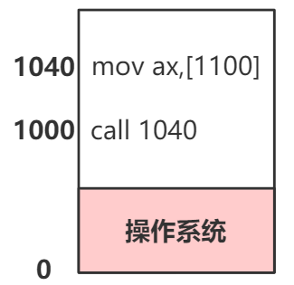

在多进程共同完成一个任务的时候，需要让进程走走停停才能保证任务正确完成。

**如何走走停停？**

    操作系统提供了现成的信号(SIGSTOP、SIGINT、SIGUSR1等)。

**但是有信号还不够，什么时候走，什么时候停？**

    用单生产/消费者场景举例：

        buffer满了，生产要停。buffer被消费了，需要唤醒生产者；
        buffer空了，消费要停。buffer有数据了，需要唤醒消费者。

    
    以某种条件让进程走走停停就完成了正确的进程同步！伪代码如下。

```cgo
    //生产 
    while (true) {
        if(counter== BUFFER_SIZE) sleep();
        …
        counter++;
        if(counter ==1) wakeup(消费者);
    }
    //消费
    while (true) {
        if(counter== 0) sleep(); 
        …
        counter--;
        if(counter == BUFFER_SIZE-1) wakeup(生产者); 
    }
```

## 上述代码貌似解决了问题，但还是不够。如果是多生产者呢？消费者怎么知道唤醒哪一个，如果有个地方能记住有多少个生产者在阻塞就好了！那么就有了信号量的概念。

什么是信号量? 记录一些信息(量)，并根据这个信息决定睡眠还是唤醒(信号)。

那么信号量可以抽象为：

```cgo
        struct semaphore  {
            int value;  //记录具体的信息量
            PCB *queue; //记录在该信号量上等待的进程
        }
        P(semaphore s); //消费信息量
        V(semaphore s); //产生信息量
```

信号量是荷兰计算机科学家Dijkstra在1965年提出的一个概念，解决了早期的进程同步问题。P和V分别是荷兰语proberen/verhogen的缩写. 其中P和V的实现分别为：

```cgo
    //消费信息量
    P(semaphore s){
        s->value--;
        if(value < 0){
           sleep(s->queue);
        }
    }
    //产生信息量
    V(semaphore s){
        s->value++;
        if(value <= 0){
           wakeup(s->queue);
        }
    }
```

**那么用信号量来解决这个生产消费问题：**

生产消费问题大概存在三个边界问题要处理：

    1. buffer total  //当前缓冲区的个数
    2. buffer free   //空闲缓冲区的个数
    3. buffer mutex  //允许访问该缓冲区的进程数目

根据边界可以定义出3个信号量(信号量一定是某种资源数目的抽象)：

    semaphore free = BUFFER_SIZE;
    semaphore total = 0;
    semaphore mutex = 1;

那么可以顺理成章的写出整个生产消费流程的逻辑：

```cgo

    //生产者
    Producer(item){
       P(free);
       P(mutex);
       add(item);
       V(mutex);
       V(total);
    }
    //消费者
    Consumer(item){
       P(total);
       P(mutex);
       remove(item);
       V(mutex);
       V(free);
    }    
```

## 上述代码貌似解决了问题，但还是不够。

在上述P/V的实现中，涉及到了在不同进程中对value的加加减减，那么在CPU取指执行的时候就会出现并发问题：

    下述汇编代码中，p1和p2为不同的进程。

    如果p1在执行add的逻辑之前，来了个时钟中断，恰好p1的时间片用完了，那么会先保存p1的寄存器上下文。
    
    接着将SS:SP寄存器切到p2，等p2执行完，再切回p1。

    P1的寄存器上下文入栈，但是此时ecx寄存器入栈的数据已经是旧的value了。

    p1和p2执行完，程序结果错误！

```nasm
    p1:
        mov  ecx,dword ptr [value]  
        add  ecx,1  
        mov  dword ptr [value],ecx 
        
    p2:
        mov  ecx,dword ptr [value]  
        add  ecx,1  
        mov  dword ptr [value],ecx            
```

**思考**：p1/p2代码块可以设想为一个临界区，临界区程序互斥执行，那么解决问题的思路有多个：

    1.p1执行中就不能被切出去（阻止调度!）
    
    2.就算p1在执行中被切出去，p2也不能执行

### 思路1的实现：

**1.外部中断开关（硬件实现）**

先来个x86里的32位FLAG寄存器:



---
**图中的IF位是外部中断开关，从8086开始就提供了CLI / STI指令，分别用来 开启/关闭 屏蔽外部中断。 按照这个思路在p1前后分别加上CLI/STI就屏蔽了时钟中断，p1执行的时候就不会被切出去。
如果是单核时代，这个方法确实可行，但如今是多核心CPU，存在多个寄存器上下文，这个方法就不好使了。**

### 思路2的实现：

**1.面包店算法（纯软件）**

        待补充....

**2.原子指令（硬件）**

```nasm
    Modifies flags: AF CF OF PF SF ZF
             Usage: CMPXCHG dest,src
```

    x86提供了cmpxchg指令。官方注释是：Compares the accumulator (8-32 bits) with dest.
    If equal the dest is loaded with src, otherwise the accumulator is loaded with dest。
    比较累加器和dest，如果dest和累加器值相等，那么把src放到dest，否者把dest加载到累加器。
    
    这就是有名的CAS，基本上所有编程语言的原子自增底层实现都是他（原子指令为啥能保证原则性就不展开了）。
    那么多核情况下呢，多核拥有多套寄存器/cache，而且存在指令重排以及可见性问题（本人其他文章有专门说），
    所以x86实现了lock前缀来提供StoreLoad Barriers，保证把写缓冲区中的数据全部刷新到主存中。把
    无效化队列中的无效化操作生效，将相应的缓存条目状态设为I。所以lock指令语义之一的Barriers保证了“可见性”。
    Barriers的另外一个作用是让lock修饰的前后操作不会发生指令重排。
    
    几乎所有的并发工具，在涉及到边界保护的实现上，都会使用lock前缀+cmpxchg指令来保证用户态程序的语义正确。
    所以，这里使用lock+cmpxchg实现p1和p2互斥。

本人不太清楚cmpxchg指令具体是怎么实现的，按照intel的文档中提到的Modifies flags: AF CF OF PF SF ZF，
没有IF位，并没有屏蔽外部中断。我暂且认为p1执行过程中还是有可能被切出去的，所以我把cmpxchg放到了思路2中。

## 最后，来个linux内核中的案例
    
    待补充....
    
    

    
    