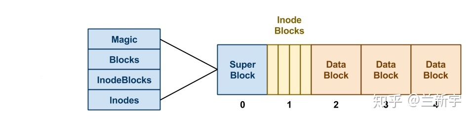
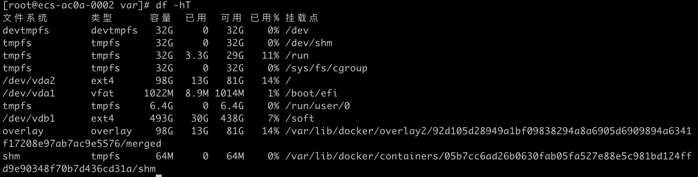

### 一. 例子

- 编写一个Tcp Server
```java
//伪代码,省略了很多...
int main(){
    //创建一个socket文件
    int listen_fd = socket(AF_INET,SOCK_STREAM,0);
    //绑定端口
    bind(listen_fd,8080);
    //把listen_fd设为监听状态
    listen(listen_fd);
    while(true){

        //获取一个连接
        int conn_fd = accpet(listen_fd); //默认是阻塞状态，所以这一行会等到有连接握手成功才会返回

        //从socket buffer中读数据到用户空间
        byte[] buf = read(conn_fd); //默认是阻塞状态，所以这一行会阻塞到socket buffer可读

        //解析数据
        parse(buf);

        //响应数据给客户端
        write(response_buf,conn_fd);//默认是阻塞状态，所以这一行会阻塞到socket buffer可写
    }
}
```
整体流程很简单:

``创建一个socket文件 -> 绑定端口 -> 设为监听状态 -> accpet获取一个连接 -> 读写这个连接的socket buffer``

代码中所有的逻辑都跑在一个线程里，而且所有的fd都是阻塞状态，这种tcp server够用吗？
```
现在有两个客户端

客户端1和server握手成功。server的accpet返回了，所以server会去执行read，但是客户端1迟迟不发数据过来。那么这个read就阻塞到客户端1的数据过来才会返回。
如这个时候客户端2的请求也来了，server无法处理
```
`怎么解决这个问题？`

---
### 二. 从各种IO模型到EPOLL
- 非阻塞IO

既然问题是「阻塞」导致单线程无法处理多个请求，那么把fd设为「非阻塞」呢？
```java
int main(){
    int listen_fd = socket(AF_INET,SOCK_STREAM,0);
    //设为非阻塞状态
    fcntl(listen_fd, F_SETFL, flag | O_NONBLOCK);
    bind(listen_fd,8080);
    listen(listen_fd);
    while(true){
        int conn_fd = accpet(listen_fd); //这行不再阻塞，有没有连接都会返回 

        if(conn_fd >= 0){
            //设为非阻塞状态
            fcntl(conn_fd, f_setfl, flag | o_nonblock);
            byte[] buf = read(conn_fd); //这行不再阻塞，有没有数据都会返回
            if(buf.size() > 0){
                parse(buf);
                write(response_buf,conn_fd);
            }
            
        }
    }
}
```
代码没什么变化，只不过把fd设为非阻塞了，那么问题解决了吗？
```
确实accpet/read/write都不会阻塞了，socket buffer中没有数据，read也不会阻塞在那，而是直接返回。
这样一个线程就能处理多个请求了，但CPU可就就100%了。
```

- BIO模型

```java
int main(){
    int listen_fd = socket(AF_INET,SOCK_STREAM,0);
    bind(listen_fd,8080);
    listen(listen_fd);
    while(1){
       //获取一个socket_fd 
       int conn_fd = accept(listen_fd);//阻塞
       new thread(()->{
            byte[] buf = read(conn_fd);//阻塞
            parse(buf);
            write(response_buf,conn_fd);
       }).start();
    }
}
```
```
对比上面的模型，BIO多了new thread这一步，这样整个server就分成了两个角色，accepter和worker。accepter为独立的线程，专门负责accept获取连接，在空闲的时候，也能阻塞。worker线程专门处理read/parse/write，这样既能处理多个请求，CPU资源也利用的比较合理。

但是如果并发非常大呢，瞬间有成千上万的请求要处理，那就创建成千上万个线程？这个方案在并发量不大的时候确实可以考虑，因为线程数目多了，内存占用会变大，而且线程上下文的也是一个开销。tomcat的BIO模式采用的就是这种方案，只不过他的worker线程做了池化，默认200个线程，如果这200个线程都已经分配出去，那么新的请求将无法响应。
```

- IO多路复用

前面的BIO模式确实能满足一部分场景，但是在并发很大导致线程数目过多的情况下，BIO是不可取的。
```
1. 非阻塞模型需要一直轮询系统调用，带来高额的CPU占用，
2. 阻塞模型需要阻塞系统调用，等待内核响应才能处理其他请求。如果要想同时处理多个请求就需要使用多线程，多线程性能瓶颈就是：较高的内存占用，和上下文切换所带来的开销。
```
所以需要这么一种机制：
```
1. 在没有请求的时候，线程能够被阻塞，不会浪费CPU资源
2. 在有listen_fd可读的时候，用户程序能够被唤醒，从内核全连接队列中accpet一个连接
3. 在有conn_fd可读的时候，用户程序能够被唤醒，从内核的socket buffer中read数据到用户空间

最好能有一个反应堆，用一个线程一直轮询他，然后线程给反应堆推fd与之感兴趣的事件，比如conn_fd的可读事件，在该事件发生的时候，内核唤醒这个线程，线程拿到fd与其事件，对fd做相应的处理。
```
`那么就有了epoll。epoll定义了3个比较重要的函数`

```
epoll_create 创建一个epoll反应堆
epollctl 给反应堆提交fd与感兴趣的事件
epollwait 询问反应堆是否有事件反生，可以阻塞让出CPU，如果有事件发生的时候会被唤醒
```
用这几个函数写出代码如下:

```c
#include <stdio.h>
#include <arpa/inet.h>
#include <unistd.h>
#include <stdlib.h>
#include <sys/socket.h>
#include <string.h>
#include <errno.h>
#include <signal.h>
#include <sys/epoll.h>
#include <fcntl.h>
 
int gSetNonblocking(int fd)
{
	int old_option = fcntl(fd, F_GETFL);
	int new_option = old_option | O_NONBLOCK;
	fcntl(fd, F_SETFL, new_option);
	return old_option;
}
 
/* 往epoll描述符添加套接字 */
void gAddfd(int epollfd, int fd, bool oneshoot)
{
	epoll_event event;
	event.data.fd = fd; 
	event.events = EPOLLIN ;
	/* 同一时刻只允许一个线程处理该描述符 */
	if (oneshoot)
	{
		event.events = event.events | EPOLLONESHOT;
	}
	epoll_ctl(epollfd, EPOLL_CTL_ADD, fd, &event);
	gSetNonblocking(fd);
}
 
void gResetOneshot(int epollfd, int conn)
{
	epoll_event event;
	event.data.fd = conn;
	event.events = EPOLLIN |  EPOLLONESHOT;
	epoll_ctl(epollfd, EPOLL_CTL_MOD, conn, &event);
}
 
int main(int argc, char *argv[])
{
	int sock = socket(AF_INET, SOCK_STREAM, 0);
	if (sock < 0)
		write(STDERR_FILENO, "socket error", 11);
 
	struct sockaddr_in addr;
	memset(&addr, 0, sizeof(addr));
	addr.sin_family = AF_INET;
	addr.sin_port = htons(10002);
	addr.sin_addr.s_addr = INADDR_ANY;
 
	bind(sock, (struct sockaddr *)&addr, sizeof(addr));
 
	listen(sock, 32767);
	signal(SIGPIPE, SIG_IGN);
 
	int epollfd;
	epollfd = epoll_create(5);
	gAddfd(epollfd, sock, false);
 
	int connfd;
	int number;
	epoll_event event[512];
	while (1)
	{
 
		number = epoll_wait(epollfd, event, 512, -1);
		if (number < 0 && errno != EINTR)
		{
			printf("epoll failure\n");
			break;
		}
		for (int i = 0; i < number; ++i)
		{
			int sockfd = event[i].data.fd;
			if (sockfd == sock && (event[i].events & EPOLLIN))
			{
				
				struct sockaddr_in cliaddr;
				socklen_t clilen = sizeof(sockaddr_in);
				connfd = accept(sock, (struct sockaddr *)&cliaddr, &clilen);
 
				if (connfd < 0)
				{
					printf("errno is -> %d:%s\n", errno, strerror(errno));
					continue;
				}
				/* 设置连接套接字EPOLLONESHOT */
				gAddfd(epollfd, connfd, false);
				//gResetOneshot(epollfd, sock);
				printf("Client connect\n");
			} /* 来子外界的信号，如在终端输入kill -signal PID给此进程时 */
			else if (sockfd == connfd && (event[i].events & EPOLLIN))
			{
				// printf("Don't process\n");
				// gResetOneshot(epollfd, connfd);
				// continue;
				printf("Start sleep(10) ...\n");
				sleep(10);
				char text[512];
				
				int ret = recv(connfd, text, 512, 0);
                while (recv > 0)
                {
                    if (ret > 0)
                    {
                        text[ret] = '\0';
                        printf("Recv(%d):%s\n", ret, text);
                    }
                    else if (ret == 0)
                    {
                        printf("Client close socket\n");
                        close(connfd);
                        break;
                    }
                    else if (errno == EWOULDBLOCK)
                    {
                        printf("Wouldblock\n");
                        break;
                    }
                    else if (errno == EPIPE)
                    {
                        printf("Broken pipe\n");
                        break;
                    }
                    ret = recv(connfd, text, 512, 0);
                }
				//gResetOneshot(epollfd, connfd);
			}
		}
	}
 
	return 0;
}

```

`代码流程很简单，主要如下:`
```
1.创建lisetn_fd -> listen -> bind 和刚刚一样
2.把listen_fd和EPOLL_IN事件注册到epoll反应堆中
3.epoll_wait被阻塞，让出CPU
4.客户端和服务器三次我收成功，EPOLL_IN事件触发，阻塞在epoll_wait的线程被唤醒
5.用户程序从lisetn_fd中accpet，从内核全连接队列中获取一个连接，也就是conn_fd
6.把conn_fd和EPOLL_IN事件注册到epoll反应堆中
7.epoll_wait被阻塞，让出CPU
8.客户端的数据成功到达服务端，内核的socket buffer可读了，EPOLL_IN事件触发，阻塞在epoll_wait的线程被唤醒
9.用户从conn_fd中读取数据到用户空间
....

就这样一直注册事件，响应事件
```
`这种事件机制，能够让用户程序单线程就能处理多个请求，而且能充分利用CPU资源!`

---
### 三. 从文件系统到VFS
前面一直在说fd，可能有的同学还不知道fd到底是个啥。要搞清楚这个就要从文件系统开始说起了。

- `文件系统`

数据要想持久化是一定要存到外部磁盘上的，对用户程序来说，磁盘是一个非常大的、线性的空间，
每次使用需要通过地址来访问数据，用户需要手动维护每块数据的位置，非常不方便。为了能让用户程序方便的使用磁盘，需要有一种能有效组织磁盘的机制。那就是文件系统。
通常来说，使用一个磁盘，用户总是需要先给他分区，然后将某个分区格式化为一个文件系统。

通常情况下，磁盘一般都是以扇区为单位，如一个扇区的大小是512k，每次磁盘读都会固定读一个扇区，也就是512k。而磁盘上的数据需要跟内存交互，内存通常是以4k为单位，是4k的整数倍。为了减少没有必要的读写呢，文件系统通常会跟磁盘进行4k对齐。比如某个文件系统要从0位置开始格式化，你非要从3位置开始格式化，导致后面读取4k的数据要跨两个扇区，产生了读写放大。所以呢文件系统一般长这样(网图):



为什么方便管理磁盘，文件系统提出了这几个概念:
```
1. 超级块: 文件系统的控制信息，比如inode的起始位置、inode和数据块的数量、文件系统魔数等等
2. inode: 数据块的索引。比如数据块的起始位置、大小、权限、编号等等
3. 数据块: 真正存用户数据的部分
```

说了那么多概念，确实磁盘被组织的比较合理了，但是用户用起来还是很不方便，总不能直接让用户去理解inode，一般来说用户都是直接使用文件路径。linux的目录也是一个特殊的文件，只不过他的数据块部分存的是其他文件的inode编号。

和windows这种分盘符的操作系统不同，类UNIX的文件系统`mount`的是路径。比如`/`目录挂载的是``ext4``文件系统，``/run``目录挂载的是``tmpfs``文件系统。此时我要在``/run``目录创建一个文件``x.txt``，那么流程是怎样的呢。



使用

```
1.获取/目录的inode号，根据inode找到数据块，数据块中存储了a目录的inode号和文件名称
2.创建文件x.txt，生成inode等信息。获取a目录的inode号，根据inode找到数据块，在数据块中增加x.txt文件的inode编号和文件名称
```
就这样，linux的树形目录结构就形成了。


前面讲了文件的创建过程，一个文件的查找过程也是同理，需要逐层查找数据块，直到找到最终的inode编号。比如``/a/b/c``，`c`文件就需要从根目录开始逐层查找。如果每次打开都要这样逐层查找的话，性能可以说相当差。所以就需要一种缓存机制，直接存储 ``/a/b/c``与``inode``的对应关系，那就是``dentry``。
```c
struct dentry {
    struct qstr d_name;
    struct inode *d_inode;
    ...
}
```
下面从``dentry``的角度来看一下linux的``硬链接``是怎么回事。可以使用`stat`命令来查看文件的`inode`信息。先创建``A``，再创建其硬链接``B``

```
[root@centos-linux test]# ln A B

[root@centos-linux test]# stat A
  文件："A"
  大小：6         	块：8          IO 块：4096   普通文件
设备：fd00h/64768d	Inode：37092038    硬链接：2
权限：(0644/-rw-r--r--)  Uid：(    0/    root)   Gid：(    0/    root)
环境：unconfined_u:object_r:home_root_t:s0
最近访问：2022-02-26 23:19:03.024000000 +0800
最近更改：2022-02-26 23:19:03.024000000 +0800
最近改动：2022-02-26 23:19:12.287000000 +0800
创建时间：-

[root@centos-linux test]# stat B
  文件："B"
  大小：6         	块：8          IO 块：4096   普通文件
设备：fd00h/64768d	Inode：37092038    硬链接：2
权限：(0644/-rw-r--r--)  Uid：(    0/    root)   Gid：(    0/    root)
环境：unconfined_u:object_r:home_root_t:s0
最近访问：2022-02-26 23:19:03.024000000 +0800
最近更改：2022-02-26 23:19:03.024000000 +0800
最近改动：2022-02-26 23:19:12.287000000 +0800
创建时间：-
```
可以看到`A`和`B`的inode编号相同，也就是说，`A`和`B`的dentry指向同一个`inode`
```
硬链接

+--------+                   +--------+
|A dentry|                   |B dentry|
+--+-----+                   +-----+--+
   |                               |
   |                               |
   |  link    +--------+    link   |
   +--------> | x inode| <---------+
              +--------+
```
如果这个时候删除`A`，`B`和`x inode`的链接并不会受影响。可以用`strace`命令追踪一下删除`A`的过程。
```
[root@centos-linux test]# strace rm -rf A
...
unlinkat(AT_FDCWD, "A", 0)              = 0
...
```
可以看到删除的过程中有一个`unlink`的过程，所以说删除一个文件只是`dentry`和`inode`做了一个`unlink`。由于`硬链接`是多个`dentry`指向同一个`inode`，所以`硬链接`的范围只能是同一个文件系统，因为不同的文件系统的inode编号有可能会重复，导致`硬链接`发生混乱。

`软链接`就不一样了，`软链接`本身就是一个文件。依旧使用上面的例子。创建文件`A`，再创建他的软链接`B`，查看他俩的`inode`信息。

ps：软链接也叫符号链接
```
[root@centos-linux test]# ln -s A B

[root@centos-linux test]# stat A
  文件："A"
  大小：6         	块：8          IO 块：4096   普通文件
设备：fd00h/64768d	Inode：37092038    硬链接：1
权限：(0644/-rw-r--r--)  Uid：(    0/    root)   Gid：(    0/    root)
环境：unconfined_u:object_r:home_root_t:s0
最近访问：2022-02-26 23:45:50.700000000 +0800
最近更改：2022-02-26 23:45:50.700000000 +0800
最近改动：2022-02-26 23:45:50.700000000 +0800
创建时间：-

[root@centos-linux test]# stat B
  文件："B" -> "A"
  大小：1         	块：0          IO 块：4096   符号链接
设备：fd00h/64768d	Inode：37092042    硬链接：1
权限：(0777/lrwxrwxrwx)  Uid：(    0/    root)   Gid：(    0/    root)
环境：unconfined_u:object_r:home_root_t:s0
最近访问：2022-02-26 23:46:08.054000000 +0800
最近更改：2022-02-26 23:46:08.054000000 +0800
最近改动：2022-02-26 23:46:08.054000000 +0800
创建时间：-
```
可以看到`A`和`B`的`inode`编号不一样，而且`B`是一个独立的`符号链接`文件，既然他是一个文件，那么他一定就有他的`inode`，`符号链接`的inode指向的数据是``另外一个文件路径``，所以这个时候删除`A`，相当于断开了`B`到`x inode`的链路，这个时候就访问就访问不到`x inode`的内容了.
```
软链接

+--------+  link   +--------+
|B dentry+-------> |A dentry|
+--------+         +--+-----+
                      |
                      |
                      |  link    +--------+
                      +--------> | x inode|
                                 +--------+
```
```
[root@centos-linux test]# cat B
hello
[root@centos-linux test]# rm -rf A
[root@centos-linux test]# cat B
cat: B: 没有那个文件或目录
```


``小结：``前面提到linux为了方便用户使用磁盘，对磁盘做了很多的抽象，让用户以`文件路径`的方式去访问文件，也说了文件系统的几个重要概念：dentry、超级块、inode、数据块。但是这种只能用于`块存储`，linux的设计哲学不是`一切皆文件`么，如果用户使用`tcp/udp`的时候也想要通过`文件路径`来操作呢。

- `VFS`

既然希望所有的读/写都能使用相同的api，那么就把所有的读/写介质抽象为不同文件系统，这样就可以在用户层面表现出一致性。linux就做了这层抽象，这就是`VFS`。

为了让`tcp/udp`也能表现出api上的一致性，`VFS`延续了前面提到的`超级块`、`inode`、`dentry`等概念，并将其抽象为`sockfs`文件系统。你可以看看自己的linux里有多少种文件系统。
```
[root@centos-linux test]# cat /proc/filesystems
nodev	sysfs
nodev	rootfs
nodev	bdev
nodev	proc
nodev	cgroup
nodev	cpuset
nodev	tmpfs
nodev	devtmpfs
nodev	debugfs
nodev	securityfs
nodev	sockfs
nodev	pipefs
nodev	anon_inodefs
nodev	configfs
nodev	devpts
nodev	ramfs
nodev	hugetlbfs
nodev	autofs
nodev	pstore
nodev	mqueue
nodev	selinuxfs
```
用户程序使用`tcp`，都会用`socket`函数打开一个文件，然后返回其`文件描述符`，对文件描述符进行读写。那么这个`文件描述符`又是啥呢。下面就要开始介绍`进程`和`文件系统`是咋联系起来的。


图中的task_struct就是内核对进程的抽象，task_struct中引用了一个files数组，所谓的`文件描述符`就是files数组的`下标`，files数组的每一项都是一个file结构体，file结构体中缓存了文件的`dentry`、`inode`等信息。这样用户程序使用`文件描述符`就可以直接找到对应`文件`的`inode`了，所以用户程序一般都是通过读写`文件描述符`来读写不同的介质。

---
### 四. EPOLL与VFS之间的关系

前面说过，用户可以把`文件描述符`和感兴趣的`事件`推给`epoll`反应堆，当事件发生的时候，epoll反应堆会将用户程序唤醒(epoll_wait返回)。`文件描述符`的背后一定是`文件系统`，那么epoll是如何作用于那么多种`文件系统`的呢？

`下面开始介绍epoll的原理：`

```
epoll_create 创建一个epoll反应堆
epollctl 给反应堆提交fd与感兴趣的事件
epollwait 询问反应堆是否有事件反生，可以阻塞让出CPU，如果有事件发生的时候会被唤醒
```
从前面的`tcp server`案例可以看出来，sever必然会频繁的accept获取conn_fd然后注册conn_fd相关的事件，数据读取完成后又会删除conn_fd对应的事件，所以会涉及到频繁的增/删/改，这种场景下内核使用了``红黑树``作为存储`epitem`（这个就是fd与事件的组合）的数据结构，红黑树作为一个平衡二叉树，有比较稳定的O(logn)时间复杂度。当事件发生后，内核又会把
`epitem`放到`就绪列表`里，然后把阻塞的线程放到`就绪队列`里，等待内核调度。


既然能被不同的文件系统唤醒，那么一定有一个注册`回调路径`的机制。前面提到了files数组的每一项都是一个file结构体，file结构体中有一个比较关键的`file_operations`结构体，它里面就包含了注册回调路径的`poll`函数。而sockfs、timerfd、eventfd、pipefs这几种文件系统就实现了`poll`函数，而`ext`系列文件系统就没有实现`poll`函数。


### 五. 从EPOLL到网关，如何设计IO模型

### 六. 网关性能对比

### 七. 另外一个层面的IO问题

### 八. 零拷贝

### 九. 几种零拷贝机制

### 十. Java零拷贝代理

### 十一. netty实现的epoll/splice存在的问题

### 十二. bug修复

### 十三. netty待优化的点