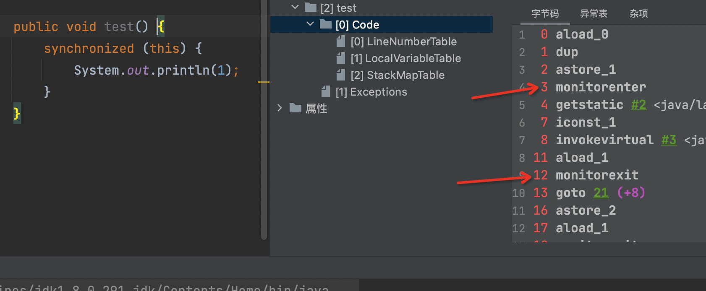
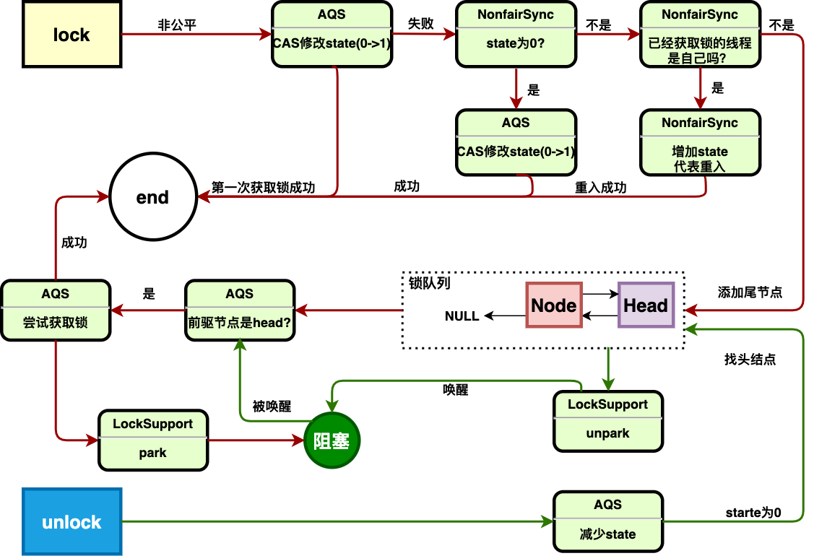

## 如何实现线程同步？
</br>

很容易想到使用mutex，来支持共享数据的互斥访问，以阻塞队列举例：
</br>

```java
//生产者
void push(Object item){
 
  lock(queue);

  while(queue is full){
    sleep(一会);//或者yield();
  }
  add(queue,item);

  unlock(queue);
}
```
上面的代码明显是不正确的。生产者一直占用着锁，不停的检查队列的状态。而消费者拿不到锁去消费队列中的元素，产生了活锁。那把判断条件的逻辑拿出来呢?

```java
//生产者
void push(Object item){
  
  while(queue is full){
    sleep(一会);//或者yield();
  }

  lock(queue);

  add(queue,item);

  unlock(queue);
}
```
这段代码也不正确，他只是添加元素的逻辑放到了临界区，对条件的判断没有做任何保护，如果存在多个生产者，A生产者和B生产者同时经过了条件判断，而且这时候队列只有一个空位，会导致一个生产者往满的队列里添加元素，明显是不正确的。那把条件判断也做保护呢？

```java
//生产者
void push(Object item){
  
  lock(queue);

  while(queue is full){
    unlock(queue);
    sleep(一会);//或者yield();
    lock(queue);
  }
  add(queue,item);

  unlock(queue);
}
```

这段代码语义正确，但是比较笨，他必须一遍遍的判断队列是不是满的，再去sleep一段时间。更好的方案是，直接让生产者线程休眠，直到队列有空位的时候醒过来。
```java
//生产者
void push(Object item){
  
  lock(queue);

  while(queue is full){
    unlock(queue);

    sleep_waitting(queue is not full));//

    lock(queue);
  }
  add(queue,item);

  unlock(queue);
}
```
这样生产者只会在需要的时候工作，不浪费CPU周期。基于这个模型，JVM定义了监视器「monitor」。monitor提供了条件访问的解决方案（如上述）、以及互斥访问的解决方案。

## monitor

一般来说，支撑起条件访问的同步工具叫做条件变量，而支撑起互斥访问的同步工具叫做mutex(互斥体)。mutex是一个低级的同步工具，而条件变量是一个高级的同步工具，他在mutex的基础上增加了wait/notify的功能。而JVM把这两者抽象成了monitor，来解决各种场景下的线程同步问题。
</br>
所以说，monitor = mutex + 条件变量。

- ### (mutex)互斥体

在JVM中，每个对象都与monitor关联，线程用字节码使用字节码monitorenter和monitorexit来锁住/解锁关联的monitor。java中的每个synchronized块的入口和出口都由monitorenter和monitorexit包裹起来。如下图：



上面提到的队列问题，用monitor的互斥体原语表示如下:
```java
//生产者
void push(Object item){
  
  monitorenter

  while(queue is full){
    monitorexit

    sleep_waitting(queue is not full));//

    monitorenter
  }
  add(queue,item);

  monitorexit
}
```
- ### 条件变量

java中wait的作用是，在一个对象上调用wait方法，首先会原子化的释放monitor锁，把当前线程置为休眠状态。直到线程被其他线程notify后，他会立马尝试获取monitor锁。所以wait实际上包含了三个操作。用synchronized和wait方法改造这个案例：

```java
//生产者
void push(Object item){
  synchronized(queue){
    while(queue is full){
      queue.wait();//等待其他线程notify
    }
    add(queue,item);
  }
}


void wait(){
  monitorexit(this);
  sleep_waitting(this);
  monitorenter(this);
}
```

小结: monitor的思想贯穿于各种条件锁,比如pthread_mutex/pthread_cond、ReentrantLock/Condition、synchronized/wait。下面一一解析

----

## ReentrantLock

用ReentrantLock编写完整的阻塞队列

```java
public class BlockQueue {

    private final ReentrantLock lock;

    private final Condition full;

    private final Condition empty;

    private final String[] arr;

    private int index = -1;

    public BlockQueue(int len) {
        this.arr = new String[len];
        this.lock = new ReentrantLock();
        this.full = lock.newCondition();
        this.empty = lock.newCondition();
    }

    public void push(String item) throws InterruptedException {
        lock.lock();
        while (index >= arr.length - 1) {
            full.await();
        }
        arr[++index] = item;
        empty.signal();
        lock.unlock();
    }

    public String pop() throws InterruptedException {
        lock.lock();
        if (index < 0) {
            empty.await();
        }
        String item = arr[index--];
        full.signal();
        lock.unlock();
        return item;
    }
}
```
按照monitor的思路可以得知：ReentrantLock和Condition分别是mutex和条件变量，await中一定封装了unlock()和lock()，lock和await都有线程阻塞/唤醒的功能，想必ReentrantLock和Condition中都封装了等待队列。按照这个思路来看看源码。

``
  lock() -> sync.lock() -> NonfairSync/FairSync
``

ReentrantLock有公平/非公平两种策略，可以手动指定，默认是非公平。

```java
//NonfairSync
final void lock() {

  if (compareAndSetState(0, 1))
      setExclusiveOwnerThread(Thread.currentThread());
  else
      acquire(1);
}
```
```
1.首先调用AQS封装好的compareAndSetState，尝试使用CAS的方式获取锁
2.cas成功，修改exclusiveOwnerThread为当前线程 -> end
3.cas失败，走AQS的acquire逻辑（等待队列）
```
```java
//AQS
public final void acquire(int arg) {
        //tryAcquire由AQS的子类实现
        if (!tryAcquire(arg) &&
            acquireQueued(addWaiter(Node.EXCLUSIVE), arg))
            selfInterrupt();
    }
}
```
```
1.首先tryAcquire尝试获取锁，tryAcquire由子类实现，这里讲非公平锁的逻辑
2.tryAcquire失败，调用AQS的acquireQueued（等待队列相关的的逻辑）
```

```java
//先详细看tryAcquire的逻辑
//tryAcquire -> nonfairTryAcquire
final boolean nonfairTryAcquire(int acquires) {
    final Thread current = Thread.currentThread();
    int c = getState();
    if (c == 0) {
        if (compareAndSetState(0, acquires)) {
            setExclusiveOwnerThread(current);
            return true;
        }
    }
    else if (current == getExclusiveOwnerThread()) {
        int nextc = c + acquires;
        if (nextc < 0) // overflow
            throw new Error("Maximum lock count exceeded");
        setState(nextc);
        return true;
    }
    return false;
}
```
```
1.判断state是否为0，0代表没有线程独占该锁
2.state为0，调用AQS封装好的compareAndSetState，再次尝试使用CAS的方式获取锁（为什么要cas两次？反正要读一次state，volatile的开销已经产生了，倒不如再判断一次state，万一有别的线程释放锁了呢）
3.同样的，cas成功，修改exclusiveOwnerThread为当前线程 -> end
4.cas失败，直接返回false，进入等待队列相关的逻辑
4.state不为0，则代表已经有其他线程独占了锁，判断当前线程是否是独占锁的线程，如果是，代表这是一次重入，state增加；否则返回false，进入等待队列相关的逻辑
```
```java
//lock等待队列的逻辑，由AQS提供
//acquireQueued(addWaiter(Node.EXCLUSIVE), arg)
private Node addWaiter(Node mode) {
    Node node = new Node(Thread.currentThread(), mode);
    // Try the fast path of enq; backup to full enq on failure
    Node pred = tail;
    if (pred != null) {
        node.prev = pred;
        if (compareAndSetTail(pred, node)) {
            pred.next = node;
            return node;
        }
    }
    enq(node);
    return node;
}

private Node enq(final Node node) {
  for (;;) {
      Node t = tail;
      if (t == null) { // Must initialize
          if (compareAndSetHead(new Node()))
              tail = head;
      } else {
          node.prev = t;
          if (compareAndSetTail(t, node)) {
              t.next = node;
              return t;
          }
      }
  }
}


final boolean acquireQueued(final Node node, int arg) {
    boolean failed = true;
    try {
        boolean interrupted = false;
        for (;;) {
            final Node p = node.predecessor();
            if (p == head && tryAcquire(arg)) {
                setHead(node);
                p.next = null; // help GC
                failed = false;
                return interrupted;
            }
            //阻塞相关逻辑
            if (shouldParkAfterFailedAcquire(p, node) &&
                parkAndCheckInterrupt())
                interrupted = true;
        }
    } finally {
        if (failed)
            cancelAcquire(node);
    }
}

```
```
1.进入addWaiter的逻辑
2.首先创建一个Node,Node中包含了当前线程、独占/共享等属性
3.将新节点的prev指向链表的尾节点
4.CAS将链表的尾结点修改为新Node，将旧尾结点的next指向新Node，完成新节点的插入
5.如果CAS失败了，或者尾结点是null，进入enq的逻辑
6.enq方法的逻辑没啥好说的，自旋+cas，保证节点最终能添加成功
4.进入acquireQueued的逻辑
5.首先判断当前节点的前驱节点是不是head，不是就滚去阻塞（等着其他线程unlock唤醒），这里的前驱节点其实就是一个dummy节点，只不过这个dummy节点是不断变化的。
6.如果是head，而且获取锁成功，就把当前节点设为head，作为一个dummy节点；如果没有获取锁成功，也滚去阻塞（等着其他线程unlock唤醒）
```

看阻塞相关的逻辑:

```java
//判断当前线程是否应该阻塞
private static boolean shouldParkAfterFailedAcquire(Node pred, Node node) {
    int ws = pred.waitStatus;
    if (ws == Node.SIGNAL)
        return true;
    if (ws > 0) {
        do {
            node.prev = pred = pred.prev;
        } while (pred.waitStatus > 0);
        pred.next = node;
    } else {
        compareAndSetWaitStatus(pred, ws, Node.SIGNAL);
    }
    return false;
}
//阻塞
private final boolean parkAndCheckInterrupt() {
    LockSupport.park(this);
    return Thread.interrupted();
}

```

这里就需要开始解释waitStatus是啥意思了：
```
CANCELLED：值为1，表示线程的获锁请求已经“取消”
SIGNAL：值为-1，代表后继节点可以被唤醒
CONDITION：值为-2，表示线程等待某一个条件（Condition）被满足
PROPAGATE：值为-3，当线程处在“SHARED”模式时，该字段才会被使用上
```
```
1.获取前驱节点的状态为waitStatus
2.如果等于-1，也就是SIGNAL，代表node所包装的线程可以被唤醒，返回true，然后阻塞当前线程
3.如果大于0，也就是CANCELLED，代表锁清秋被取消，删除前驱节点
4.如果小于等于0，比如初始状态就是0，就把前驱节点的状态改为SIGNAL，下次循环就可以回到2了。
```
``小结：线程没有获取到锁->加入队列->阻塞``

看unlock的逻辑，相对比较简单

```java
//unlock->release
public final boolean release(int arg) {
    if (tryRelease(arg)) {
        Node h = head;
        if (h != null && h.waitStatus != 0)
            unparkSuccessor(h);
        return true;
    }
    return false;
}
//减少重入次数
protected final boolean tryRelease(int releases) {
    int c = getState() - releases;
    if (Thread.currentThread() != getExclusiveOwnerThread())
        throw new IllegalMonitorStateException();
    boolean free = false;
    if (c == 0) {
        free = true;
        setExclusiveOwnerThread(null);
    }
    setState(c);
    return free;
}
private void unparkSuccessor(Node node) {
    int ws = node.waitStatus;
    if (ws < 0)
        //重新初始化头节点
        compareAndSetWaitStatus(node, ws, 0);
    //唤醒next节点
    Node s = node.next;
    if (s == null || s.waitStatus > 0) {
        s = null;
        for (Node t = tail; t != null && t != node; t = t.prev)
            if (t.waitStatus <= 0)
                s = t;
    }
    if (s != null)
        //最终唤醒的地方
        LockSupport.unpark(s.thread);
}

```
```
1.首先调用tryRelease减少重入的次数，减到0，清除exclusiveOwnerThread，返回true
2.判断head的waitStatus，只要不是0，就唤醒前驱节点的next节点
```
``唤醒阻塞的线程后，他会继续完成lock的逻辑，最终拿到锁``
```java
final boolean acquireQueued(final Node node, int arg) {
    boolean failed = true;
    try {
        boolean interrupted = false;
        for (;;) {
            final Node p = node.predecessor();
            if (p == head && tryAcquire(arg)) {
                setHead(node);
                p.next = null; // help GC
                failed = false;
                return interrupted;
            }
            //阻塞相关逻辑
            if (shouldParkAfterFailedAcquire(p, node) &&
                parkAndCheckInterrupt())
                interrupted = true;
        }
    } finally {
        if (failed)
            cancelAcquire(node);
    }
}
```
``ps：被唤醒后，他的waitStatus被重新初始化为0，又会重复刚刚的逻辑``

```
1.尝试获取锁
2.获取失败后，修改前驱节点的状态为SIGNAL，
3.获取成功后，把head节点修改为自己，因为会有其他竞争锁失败的线程把他当作前驱节点
```
流程图如下：


小结：唤醒总是从head开始，排队也总是往后排，那非公平体现在哪呢。ex:A是刚调用lock的线程，B是刚被唤醒的线程，他们之前竞争锁是非公平的。如果不好理解的话，可以看看公平锁是咋实现的，公平锁在tryAcquire的时候并不会直接while+CAS竞争锁，而是先去查看队列中是否有node在排队，如果发现有node在排队，会直接tryAcquire
---
互斥体的逻辑相对比较简单。前面提到过，monitor包含了互斥体和条件变量，下面开始解析条件变量：

```java
public final void await() throws InterruptedException {
    if (Thread.interrupted())
        throw new InterruptedException();
    Node node = addConditionWaiter();
    long savedState = fullyRelease(node);
    int interruptMode = 0;
    while (!isOnSyncQueue(node)) {
        LockSupport.park(this);
        if ((interruptMode = checkInterruptWhileWaiting(node)) != 0)
            break;
    }
    if (acquireQueued(node, savedState) && interruptMode != THROW_IE)
        interruptMode = REINTERRUPT;
    if (node.nextWaiter != null) // clean up if cancelled
        unlinkCancelledWaiters();
    if (interruptMode != 0)
        reportInterruptAfterWait(interruptMode);
}
//给条件队列添加节点
private Node addConditionWaiter() {
    Node t = lastWaiter;
    // If lastWaiter is cancelled, clean out.
    if (t != null && t.waitStatus != Node.CONDITION) {
        unlinkCancelledWaiters();
        t = lastWaiter;
    }
    Node node = new Node(Thread.currentThread(), Node.CONDITION);
    if (t == null)
        firstWaiter = node;
    else
        t.nextWaiter = node;
    lastWaiter = node;
    return node;
}
```
```
1.首先创建waitStatus为CONDITION的节点，加入条件队列尾部
2.将lock的state减至0,并唤醒头结点,保持savedState到栈里（留着唤醒后使用）
3.判断当前节点是否在同步队列，如果在直接阻塞（正常await逻辑就是直接阻塞,这个判断是留给signal用的）
```

```java
public final void signal() {
    if (!isHeldExclusively())
        throw new IllegalMonitorStateException();
    Node first = firstWaiter;
    if (first != null)
        doSignal(first);
}

private void doSignal(Node first) {
    do {
        if ( (firstWaiter = first.nextWaiter) == null)
            lastWaiter = null;
        first.nextWaiter = null;
    } while (!transferForSignal(first) &&
                (first = firstWaiter) != null);
}
final boolean transferForSignal(Node node) {
    if (!compareAndSetWaitStatus(node, Node.CONDITION, 0))
        return false;
       /* Splice onto queue and try to set waitStatus of predecessor to
        * indicate that thread is (probably) waiting. If cancelled or
        * attempt to set waitStatus fails, wake up to resync (in which
        * case the waitStatus can be transiently and harmlessly wrong).
        */
    Node p = enq(node);
    int ws = p.waitStatus;
    if (ws > 0 || !compareAndSetWaitStatus(p, ws, Node.SIGNAL))
        LockSupport.unpark(node.thread);
    return true;
}
```

```
1.获取头结点，并doSignal
2.将该节点放到同步队列，while保证最终能成功
```

```
//transferForSignal
1.第一个CAS保证该节点没有被取消
2.入同步队列
3.修改waitStatus为SIGNAL,并唤醒唤醒头结点线程
```
继续解析唤醒后的逻辑

```java
public final void await() throws InterruptedException {
    if (Thread.interrupted())
        throw new InterruptedException();
    Node node = addConditionWaiter();
    long savedState = fullyRelease(node);
    int interruptMode = 0;
    while (!isOnSyncQueue(node)) {
        LockSupport.park(this);
        if ((interruptMode = checkInterruptWhileWaiting(node)) != 0)
            break;
    }
    if (acquireQueued(node, savedState) && interruptMode != THROW_IE)
        interruptMode = REINTERRUPT;
    if (node.nextWaiter != null) // clean up if cancelled
        unlinkCancelledWaiters();
    if (interruptMode != 0)
        reportInterruptAfterWait(interruptMode);
}
```

```
1.唤醒后,先判断当前节点是否在同步队列，明显是在的，所以while这里就过了
2.acquireQueued，这就和上面lock里的逻辑一样了，会尝试获取锁，获取不到就在同步队列上阻塞
```
源码有个点要主要，最终轮询的节点为当前node的前驱节点，设想如果不去轮询前驱节点，而是一个全局变量？那么会导致不同cpu都要访问这个全局变量，产生额外的缓存同步开销，每个线程去轮询不同的节点，开销就会大大降低。但是这会有个问题（假如当前节点和前驱节点位于不同的NUMA node，要读取当前节点是因为当前节点是下个线程的前驱节点，要唤醒人家的嘛），这就导致了较大的延迟，性能很差。网上说MCS队列解决了NUMA的问题，我觉得不对。CLH队列和MCS队列没有本质的区别，一个轮询前置节点，一个轮询当前节点。不管怎样，总要unlock去唤醒下一个队列节点。如果这个两个队列节点在不同的NUMA node，性能还是一样差。真正解决这个问题的是qspinlocks。