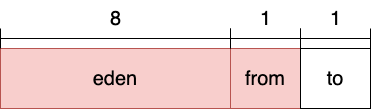
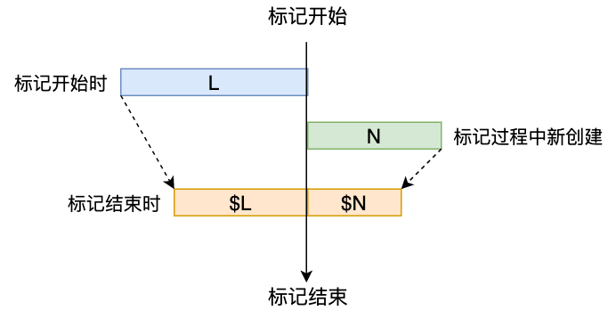
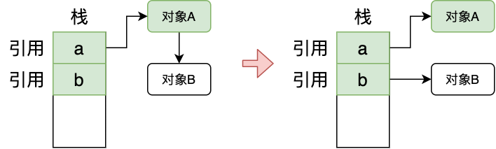
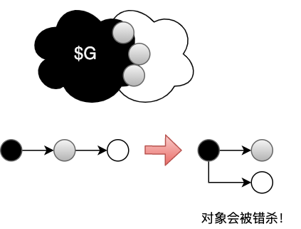

- ## 引子

```
Java作为一个安全语言，不会向程序员提供内存管理api，而是把这个任务交给垃圾收集器，程序员不需要关心对象分配在哪，也不需要关心对象如何分配/回收内存。本文会详细介绍这一机制。
```    

---

### **对象什么时候死?**

```
传统静态编译器会使用『活性分析』算法来确定一个对象的生存期：如果一个变量持有一个值，那么这个变量的生存期以『对这个变量的第一次写』开始，以『对这个变量的最后一次读结束』，在这期间，该变量都是活跃的。

这种方式确实可以确定变量的生存期，但是只能局限于某个方法内的局部变量，因为java是个动态性很强的语言，拥有虚方法（多态）和异常抛出这种运行期才能明确的过程跳转，是的，根本无法静态分析出下个代码块是啥，又怎么能确定变量的生存期呢（比如发生参数传递的方法跳转）。

但『活性分析』也不是一无是处，编译器为保证程序的局部性，会对方法进行『逃逸分析』，分析出方法的局部变量，辅助『寄存器分配』这样的优化。

ps：『逃逸分析』不属于GC的范畴，他只是辅助runtime做一些优化。逃逸分析由-XX:+DoEscapeAnalysis参数控制，jdk1.8默认开启。
```

```java
class 活性分析案例1 {

   int a = 1;
   
   void 优化前(){
        while(1w次){
            a++;
        }
        print(a);
   }
   
   void 优化后(){
        //栈上分配
        int temp = a;
        while(1w次){
            temp++;
        }
        print(temp);
   } 
}

class 活性分析案例2 {

   void test(){
        for(int i = 0; i < 5000000; i++){
            createObject();
        }
   }
   
   public static void createObject(){
        //加锁
        synchronized (new Object()){

        }
   }
}
```

```
案例1：局部优化。

案例2：
      第一个点：逃逸分析后对象直接进行『标量替换』，使test方法结束后直接回收对象，减少垃圾收集器压力。
      第二个点：逃逸分析后进行锁消除，直接忽略synchronized关键字。
      
ps: 标量替换：Java的原始类型无法被分解可以被看作『标量』，引用(指针)也无法被分解可以被看作『标量』。
            而一个对象一定是标量的聚合体，把对象分解为标量后可以被编译器优化，在栈/寄存器上分配。
            
注意！Java对象在实际的JVM实现中可能在GC堆上分配空间，也可能在栈上分配空间，也可能完全就消失了。
```

由此可以得出，一个对象什么时候该被回收，这个时间点难以精准确定，因为这需要预测程序未来的行为。 但是可以用对象『是否可达』来近似对象『是否已死』，当发现一个对象不可达的时候，这个对象肯定已经死过了（可能死好一会了）。虽然回收的时间肯定会晚于对象死的时间，但这绝对是『及时性』和『分析复杂度』 的一个合理的妥协！下面会详细介绍几种『可达算法』。

---
## **引用计数（RC）**

```
判断一个对象是否可达，很直观的一种方式『引用计数』，就是把对象的引用数目用计数器维护起来，当对象被
引用时，就递增计数器；当引用被覆盖时就递减计数器，当计数器减少至0的时候，这个对象就需要被回收，回收
当前对象时需要减少当前对象引用的所有对象的计数器。

比如S对象引用了A、B、C，那么S被回收时，A、B、C三个对象的计数器要递减，这个过程会被持续传递！
```

下面介绍一个简单的引用计数实现：

```
首先是引用计数指令的抽象，如下：
       
       incRC    RC递增
       decRC    RC递减
       testRC   判断RC是否降为0，如果是，进行传递回收
```

> RC指令需要『编译器插桩』到代码中，比如：
>> 1.对象obj1的一个引用加载到栈上，比如『Ref ref1 = obj1』 ，需要插入『incRC obj1』。
>
>> 2.ref1从指向obj1切换为obj2，比如『Ref ref1 = obj2』，需要插入『incRC obj2』、『decRC obj2』、『testRC obj2』。
>
>> 3.ref1指向obj1，ref1指向切换为NULL，然后ref2指向obj1，ref1指向切换为NULL。需要插入『incRC obj1』、『decRC obj1』、『testRC obj1』、『incRC obj2』、『decRC obj2』、『testRC obj2』

> 这种RC存在的问题：

>> 可以发现，RC可能会带来巨大的运行时开销。而这些开销很多都是冗余的，比如上述的案例3，这一连串的incRc、decRC、testRC其实完全可以替换为一个testRC。
>
>> 多线程应用程序中更新RC需要原子指令，原子指令都是代价昂贵的
>
>> A引用B，B引用A，这就形成了循环引用，然而引用计数没有维护『依赖网』，所以根本无法检测出是否循环引用。虽然没有其他变量引用他们，但A和B的引用计数始终无法归零，产生了A和B这俩漂浮垃圾。
---
## **对象追踪**

上面提到过RC主要问题是没有维护『依赖网』，对象追踪可以解决这一问题，主要分为两步：

- 1. 根集枚举。确定执行上下文（栈、寄存器、全局变量）中的所有槽位。

- 2. 堆追踪。遍历『对象邻接图』,直到所有对象都被访问到。

通常情况下，对象追踪不能在用户程序活跃的时候进行，因为这个时候『执行上下文』和『对象图』都在持续变化。这个时候
『对象追踪』和『用户程序执行』是竞争的关系。因此GC开始对象追踪时候需要暂停用户程序，也叫STW（stop-the-world）。

ps：并不是所有的语言都能进行『根集枚举』，非安全语言可能会让编译器很迷惑，比如在整数变量中保存引用。

---
## **安全点**
//TODO
## **分代回收**

有这么一个假设「大部分对象都会die young，没有die young的对象生命期都会很长」，这个假设来源于很多应用的行为分析。
基于这个假设：那么可以让对象都在young gen中创建，然后对其频繁回收，由于大部分对象都会die young，所以young gen
非常适合copy算法，减少碎片的同时还能提高GC效率。

Hotsport VM把young gen分为了eden、survival两个区域，其中survival又分成了from、to两个区域。一个对象的young gen之旅如下：



- 1. 对象先在eden区分配
- 2. eden达到阈值触发young gc，进行复制-清除，将幸存对象copy至to
- 3. 回收from区，同样复制-清除，copy至to
- 4. to变为from，from变为to
- 5. 以此轮回下去。这个过程中对象每次从from copy到to，年龄都会+1
- 6. 对象在某次copy中年龄达到了阈值，copy到old gen

```
ps: 为什么要把survival分成两块呢？

     首先是为什么需要survival区域？这源于young gen的对象年龄设计，每次对象年龄增长总要有个区域用来复制（总不能直接复制到old gen吧，这样年龄就没意义了），所以就有了survival。
     为什么要分成两块呢？首先要明白复制算法一定要有个区域用于复制。如果只有一块，那么在survival就只能使用标记清除算法，容易产生内存碎片，违背了young gen设计的初衷。也有人说，那为什么不能再来一次内存整理呢？我猜测是内存整理的开销远远大于复制，索性浪费一小块内存用来复制反而更实在。
```
 下面是几种基本GC算法的性能对比:   

|  | mark-sweep | mark-compact | copy |
| :-----| :-----| :-----| :-----|
| 速度 | 中等 | 最慢 | 最快 |
| 空间开销 | 少（但会堆积碎片） | 少（不堆积碎片） | 通常需要活对象的2倍大小（不堆积碎片） |
| 移动？ | 否 | 是 | 是 |


---
---

## **CMS垃圾收集器**

CMS(Concurrent Mark Sweep)收集器是一个以『低延迟』为特点的垃圾收集器，适合主流的B/S系统。
从命名也能看出来，CMS能和用户程序并发执行，他的回收区域为「old gen」，其回收过程如下：

- 1. **初始标记**：根集枚举，列举所有GC ROOT能直接关联到的对象。由于CMS并不是whole heap垃圾收集器，所以CMS回收old gen时，必须把young gen算作是ROOT，那么CMS的GC ROOT包含栈、寄存器、全局变量以及young gen。（同样的道理，young gen GC也要把old gen作为GC ROOT）
- 2. **并发标记**：开始对象追踪，标记所有可达的对象，这个过程与用户线程并发执行
- 3. **重新标记**：重新扫描2步中「write barrier」维护的「记忆集」以及GC ROOT
- 4. **并发清除**：清除对象

>**分析**

**并发标记：** 既然CMS的特点是低延迟，他的STW时间要足够小。为了达到这一目的：GC线程(回收器)和用户线程(修改器)应尽量并发。而在并发过程中，回收器的标记阶段需要遍历对象邻接图，「这个时候」对象邻接图是在变化的，大致有两种变化：

- 1. 「修改器」修改对象的引用字段，这可能会导致某个对象死亡。假设在活跃对象集“L”中，标记结束后仍然可达的对象为集合“$L”，那么有 $L为L的子集。

- 2. 「修改器」创建了新的对象，这些对象可能一直可达，也有可能死亡。假设标记阶段创建的新的对象为集合“N”，标记结束后，他们中仍然可达的对象为集合“$N”，那么有 $N为N的子集。



可以得出结论，经过并发标记后，真正活跃的对象集为  $L + $N ，且  **L + N ⊆ $L + $N** 。

为了保证正确性，并发标记期间不能丢失任何活跃的对象（不能错杀），那么可以用所有活跃对象的超集 L + N ，并发标记结束后，再扫描一遍，不就可以保证正确性了么，这种方式叫做原始快照 SATB（Snapshot-At-The-Beginning）。

还有另外一个思路，并发标记结束后，找到真正的活跃对象 $L + $N，这种方式叫做增量更新 INC（ Incremental Update），而CMS采用的就是 INC。

不管是SATB还是INC，都需要一个维护引用变更的机制，这个机制就是 「写屏障」。下面提供INC的伪代码：

```c
//src:某个对象，slot:某个槽，new_ref;新引用
write_barrier_ref(Object* src,object** slot,Object* new_ref){

     *slot = new_ref();

     if( is_marked(src) ){
          remember(new_ref());
     }
}
```
代码解释：

```
如果当前对象已经被标记了，对这个对象的某个槽赋予新引用时，write_barrier需要记忆new_ref。如果当前对象没有被标记，write_barrier不需要记忆任何东西，等当前对象被标记的时候自然会去扫描他的new_ref。
```
案例：



在并发标记的过程中，a、b、A都已经被标记，这个时候修改器断开A和B之间的引用，让b引用B，如果write_barrier没有记忆这个引用变更，对象B就会被错杀。既然write_barrier记忆了会被错杀的对象，那么应该在并发标记之后来一次重新标记，保证正确性！重新标记稍后介绍。

**标记过程中的三色标记：** 假设对象图为 G，其中 $G 都已经被扫描过，那么 (G-$G) 部分还没被扫描。假如这个时候修改器在修改对象图，那么会产生两种效果：

- 1. $G 的一部分对象死亡，但作为漂浮垃圾保留。(write_barrier只处理新引用)

- 2. (G-$G)的一部分对象失去连接，只与 $G 中的对象连接。

第一种效果不会导致正确性的问题，而第二种则会导致对象被错杀。实际上，CMS的标记过程并不是「非黑即白」，还有一个「灰」。下面用三色标记术语来解释上述问题。



扫描过的对象 $G 为黑色。未扫描的对象 (G - $G)为白色。灰色为扫描过，但slot没有扫描完全，如图中的灰色对象。灰色对象是已经确定可达，但是他引用的对象还未完全确定。一个对象不会直接从黑色变成白色。

如图所示，在并发标记过程中，修改器修改引用，使黑色对象直接引用白色对象，如果没有STAB或者INC写屏障，这个白色对象会被错杀，因为扫描过的黑色对象不会再被扫描。

按照这个思路，在三色标记的过程中，有两种情况会导致对象被错杀：

     1.原本在(G-$G)中的可达对象，现在只有从$G中扫描过的对象到达。这种情况会被INC写屏障追踪。

     2.原本在(G-$G)中的可达对象，现在只有从非堆位置到达，如栈、寄存器等GC根节点。这种情况不会被INC写屏障追踪！

>**总结**

那么从三色标记的角度，解释了为什么需要STAB、INC写屏障。也可以得出，重新标记是必须的，而且需要扫描「记忆集(写屏障)」和 「GC根节点」。还有几个点要注意！

     1.CMS的GC根节点包含了整个young gen。可能会有这样的疑问，为什么young gen不去维护「remembered set」，而是在CMS标记时，扫描整个young gen？使用remembered set的初衷就是为了减少扫描的非收集区域大小，只扫描有变化的部分，然而young gen的引用变更实在是太频繁了，给young gen维护remembered set会产生很大的开销，而且影响吞吐量！索性就把整个young gen都作为GC Root（扫描但不被收集）
     注：astore1，等修改栈指针的字节码不会引发write barrier，能引发write barrier的字节码只有putfield，putstatic和aastore。

//TODO

注：jvm利用虚拟内存来实现GC写屏障。并发标记时，会把把页面设为写保护，然后用户程序修改对象引用会触发页面异常，这个时候执行页面异常处理程序去保存快照。所以这个时候页面需要两种访问权限，1,用户程序访问触发页面异常；2,GC程序正常扫描访问。怎么实现一个物理页映射成两个不同访问权限的虚拟地址呢。用shm_open创建共享内存对象，用不同的保护权限映射两次。
异常处理过程：异常处理程序去判断当前页面中的对象是不是引用发生了变更，比如从断开了灰色对象到白色对象的引用，也就是说异常处理程序接管了这个修改引用的过程，他会保存这个页面所有的旧数据。


**CMS调优案例**


