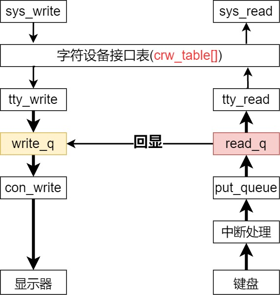

继续上篇那张图：
```markdown
                +-------+    +--------+
                |  CPU  |    | Memory |
                +---+---+    +---+----+
                    |            |
CPU-Memory Bus  +---+------+-----+----+
                           |
                  +--------+-------+
                  | Bus Controller |
                  +--------+-------+
                           |
       PCI Bus  +----------+---------------------------------------+---------------+
                                                                   |
                                                            +------+-------+
                                                            |   keyboard   |
                                                            +--------------+
```
结合上篇文章，『设备管理』无外乎两点：1.向上封装指令，2.中断处理程序。 
键盘这边处理就很简单了：每按一次按键都会触发一个键盘中断`->`中断处理程序使用intb指令读取扫描码`->`通过扫描码查询keymap找到对应的ascii码`->`可选是否写到终端（上篇提到的con_write）
`代码相对比较简单，就不逐行分析了。`

这就完整的描述了：『按下键盘到屏幕上显示字符』的全部流程。

